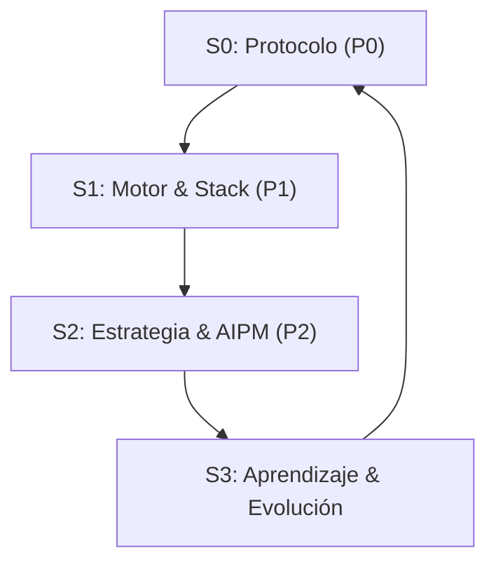

# Filosofía de Trabajo — Source of Truth 🔱

**Este directorio es la FUENTE DE VERDAD** para las reglas del PersonalOS.

> ⚠️ **DOCUMENTO LEGACY:** Este README describe el sistema **Triada AI-Prime** (v1.0, 2026-04-18). El sistema actual (v4.0) está en `01_Personal_Os/00_Core/01_Rules/` con 13 reglas numeradas 00-12.

---

## 🏛️ Sistema Dual de Reglas

| Sistema                        | Ubicación                          | Qty                                | Estado     |
| ------------------------------ | ---------------------------------- | ---------------------------------- | ---------- |
| **Triada AI-Prime (Legacy)**   | `.claude/02_Rules/`                | 25 rules (01-35, algunos saltados) | Convive    |
| **Consequences v4.0 (Active)** | `01_Personal_Os/00_Core/01_Rules/` | 13 rules (00-12)                   | **ACTIVO** |

> 📂 Los sistemas paralelos `.claude/02_Rules/` (Legacy) y `.agent/00_Rules/` (Backup) coexisten por compatibilidad.

---

## 📋 Índice de Reglas (Legacy — 25 archivos)

| #   | Regla                                | Propósito                                   |
| --- | ------------------------------------ | ------------------------------------------- |
| 01  | `01_Context_Protocol.mdc`            | Protocolo de contexto obligatorio (Génesis) |
| 02  | `02_Pilar_Base.mdc`                  | Pilares fundamentales del sistema           |
| 03  | `03_Pilar_Motor.mdc`                 | Motor y stack técnico                       |
| 04  | `04_Pilar_Estrategia.mdc`            | Estrategia y AIPM                           |
| 05  | `05_ritual-integrity.mdc`            | Integridad de ritus                         |
| 06  | `06_Claude_Integration.mdc`          | Integración Claude                          |
| 07  | `07_Skill_Fusion.mdc`                | Fusión de skills                            |
| 08  | `08_Observability.mdc`               | Observabilidad                              |
| 09  | `09_Elite_Reporting.mdc`             | Reporting de élite                          |
| 10  | `10_Context_Management.mdc`          | Gestión de contexto                         |
| 11  | `11_Workflow_Standards.mdc`          | Estándares de workflow                      |
| 12  | `12_Audit_OS_Integrity.mdc`          | Integridad y auditoría OS                   |
| 13  | `13_Testing_Resource_Management.mdc` | Testing y recursos                          |
| 14  | `14_Invoice_Intelligence.mdc`        | Inteligencia de facturas                    |
| 15  | `15_Backlog_Processing.mdc`          | Procesamiento de backlog                    |
| 16  | `16_Brainstorming.mdc`               | Brainstorming                               |
| 17  | `17_Genesis.mdc`                     | Protocolo de inicio de sesión               |
| 18  | `18_Morning_Standup.mdc`             | Standup matutino                            |
| 19  | `19_Planning.mdc`                    | Planificación                               |
| 20  | `20_Recap_Morning.mdc`               | Recap matutino                              |
| 21  | `21_Gentleman_Framework.mdc`         | Framework Gentleman                         |
| 35  | `35_Pencil_Design_Studio.mdc`        | Estudio de diseño Pencil                    |

> 📝 **Nota:** Los números 23-34 fueron deprecados/absorbidos por otros archivos en la evolución del sistema.

---

## 🔄 El Bucle de Oro (The Golden Loop)

El sistema opera bajo un flujo circular que asegura que cada acción sea estratégica:

- **ADN (Pilar 0)**: Define el Protocolo.
- **Músculo (Pilar 1)**: Ejecuta con el Motor.
- **Cerebro (Pilar 2)**: Orquesta la Estrategia.

---

_ "El código es temporal, los Pilares son eternos." _