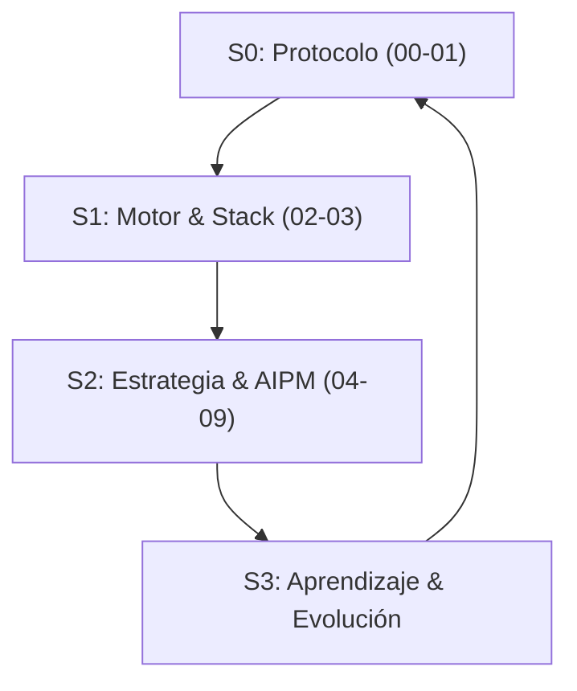

# Reglas del Sistema — PersonalOS v2.0 Consequences

Este directorio contiene el **backup** de las 10 reglas activas de PersonalOS.

> **FUENTE DE VERDAD:** `01_Personal_Os/01_Core/01_Rules/`

---

## 🏛️ Filosofía: La Tríada AI-Prime 🔱

El sistema opera bajo **3 Pilares Cognitivos** que maximizan la eficiencia del asistente:

1. **Protocolo (00-01):** ADN operativo, estándares de idioma (Español), bucle de evolución.
2. **Motor (02-03):** Ingeniería profunda, Armor Layer, Premium UI, estándares de ejecución.
3. **Estrategia (04-09):** Observabilidad, contexto, Token Economy, Agent Teams.

---

## 📋 Índice de Reglas (10 archivos .mdc)

| #     | Regla                           | Propósito                                   |
|-------|---------------------------------|---------------------------------------------|
| 00    | `00_Core_Protocol.mdc`          | Protocolo de inicio obligatorio (Génesis)   |
| 01    | `01_Pilares_Sistema.mdc`        | 12 Leyes Maestras + ADN del sistema         |
| 02    | `02_Motor_Agent.mdc`            | Motor y stack técnico                       |
| 03    | `03_Protocolos_Ejecucion.mdc`   | Protocolos de ejecución y AIPM              |
| 04    | `04_Observabilidad.mdc`         | Observabilidad y métricas                   |
| 05    | `05_Reporting.mdc`              | Reporting de élite                          |
| 06    | `06_Contexto_Gestion.mdc`       | Gestión de contexto y sub-agentes           |
| 07    | `07_Docs_Guias.mdc`             | Estándares de documentación                 |
| 08    | `08_Token_Economy.mdc`          | 10 leyes Token Economy (10x Claude)         |
| 09    | `09_Agent_Teams_Protocol.mdc`   | Protocol multi-agente (Super Campeones)     |

---

## 🔄 El Bucle de Oro (The Golden Loop)

El sistema opera bajo un flujo circular:

- **ADN (00-01)**: Define el Protocolo.
- **Músculo (02-03)**: Ejecuta con el Motor.
- **Cerebro (04-09)**: Orquesta la Estrategia.

---

_"El código es temporal, los Pilares son eternos."_

_Actualizado: 2026-04-24 | PersonalOS v2.0 Consequences_
