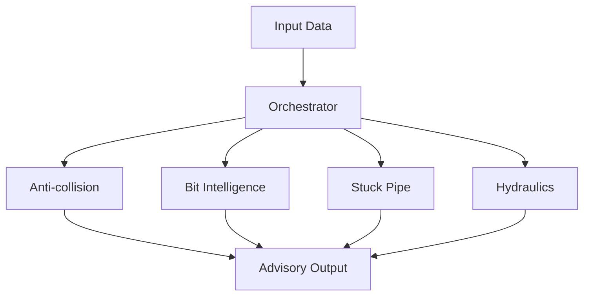

# Motor de Cálculo de Perforación

Motor principal de cálculo para ingeniería de perforación. Contiene motores para:
- Cálculo de colisión anti (anti-collision)
- Predicción ROP (Rate of Penetration)
- Predicción de pipe atascado (stuck pipe probability)
- Optimización de parámetros de broca
- Análisis de riesgo direccional

## Módulos Principales

| Módulo                 | Descripción                                                   |
|-----------------------|--------------------------------------------------------------|
| `anti-collision.ts`    | Detección y prevención de colisiones entre pads de perforación|
| `bit-intelligence.ts`  | Modelos predictivos de ROP, stuck pipe y optimización de broca|
| `stuck-pipe.ts`        | Análisis de punto libre y probabilidad de stuck pipe          |
| `orchestrator.ts`      | Orquestador que coordina todos los motores de cálculo         |
| `circulation.ts`       | Análisis de circulación de lodo                               |
| `directional.ts`       | Análisis direccional y trayecto                               |
| `hydraulics.ts`        | Cálculos hidráulicos del sistema                              |
| `surge-swab.ts`        | Efectos de surge y swab en el pozo                            |
| `well-control.ts`      | Control de pozos y gestión de emergencias                     |
| `physics.ts`           | Físicas generales de perforación                              |
| `torque-drag.ts`       | Cálculo de torque y arrastre                                  |
| `pump.ts`              | Especificaciones y operación de la bomba                      |
| `rheology.ts`          | Rheology properties of drilling mud                           |
| `cuttings-transport.ts`| Transporte de cuttings                                        |

## Flujo de Trabajo

## Estado Actual

- **55/55 tests passing** en todos los módulos
- **TypeScript: 0 errores** en todos los archivos
- **Auditoría Judgment Day: APPROVED** (2 jueces ciegos, 0 hallazgos severos)
- **Todos los alerts en español**, sin ts-ignore/ts-nocheck
- **Pipeline SDD completado**: 4 changes integrados (anti-collision, alerts, stuck-pipe, ML/AI layer)

## Cambios Recientes

- Anti-collision: 6 bugs corregidos + conexión orchestrator
- Alertas: 3 nuevas familias (Inteligencia de Bit, Motor Gemelo)
- Stuck-pipe: Free point depth + predictStuckPipeProbability
- ML/AI: predictROP, predictStuckPipeProbability, optimizeBitParameters
