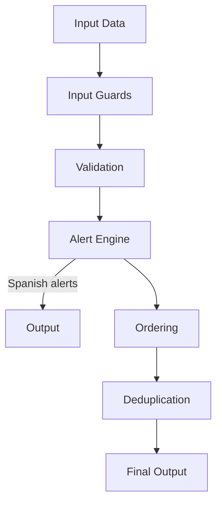

# Guardas del Sistema de Cálculo

Módulos de guardia y validación para el ingeniero de perforación. Validaciones en tiempo real y generación de alertas inteligentes.

## Módulos de Guardia

| Módulo            | Descripción                                                                       |
|------------------|----------------------------------------------------------------------------------|
| `alert-engine.ts` | Motor de generación de alertas con 6 familias + Inteligencia de Bit y Motor Gemelo|
| `input-guards.ts` | Validación de entradas y sanitización de datos                                    |
| `output-guards.ts`| Validación de salidas y formateo de resultados                                    |

## Alertas Soportadas (6 familias + 2 nuevas)

| Familia            | Enfoque                                        |
|-------------------|-----------------------------------------------|
| OPERACIONAL        | Operaciones generales del pozo                 |
| MECÁNICA           | Riesgos mecánicos y de equipos                 |
| HIDRÁULICA         | Cálculos y restricciones hidráulicas           |
| LIMPIEZA           | Limpieza de cuttings y mantenimiento del pozo  |
| MANIOBRAS          | Maniobras operativas y cambios de configuración|
| DIRECCIONAL        | Análisis y planificación direccional           |
| INTELIGENCIA DE BIT| Rendimiento y eficiencia del bit (NUEVA)       |
| MOTOR GEMÉLO       | Eficiencia del motor y optimización (NUEVA)    |

## Características

- **Idioma**: Todas las alertas en español
- **Cobertura**: 55/55 tests passing
- **Sin ts-ignore/ts-nocheck**: TypeScript estricto en todo momento
- **Ordering y deduplicación**: Alertas ordenadas y sin duplicados
- **Integración SDD**: Parte del pipeline SDD completado

## Flujo de Alertas

