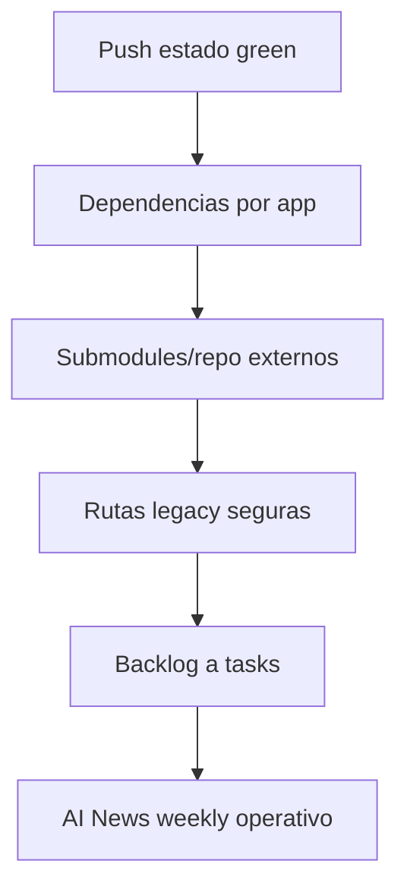

# Plan de Continuidad — Think Different PersonalOS v4.1

**Fecha:** 2026-05-22
**Estado base:** v4.1 SOTA audit green
**Último commit validado:** `d49098260 docs(session): update Process Notes with final audit results and new skills`
**Modo:** Ejecución aprobada por usuario: resolver todo preservando información útil.

---

## 0. Principio Rector

No borrar información útil. Solo eliminar o reemplazar contenido cuando sea un bug confirmado, configuración rota, secreto, duplicado dañino o artefacto generado que bloquee el sistema.

Cada fase debe terminar con:

1. validación técnica,
2. resumen de cambios,
3. decisión de commit/push,
4. registro en Engram si hubo hallazgos, decisiones o fixes.

---

## 1. Estado Actual Confirmado

| Área         | Estado      | Evidencia                                               |
|-------------|------------|--------------------------------------------------------|
| Runtime OS   | ✅ Green     | `02_Playground/01_OS_Runtime_Test.py` → 20/20           |
| Skills       | ✅ Green     | 393 skills indexadas, 0 frontmatter faltante            |
| Manifests    | ✅ Green     | `20_System_Mapper_Hub.py --validate` OK                 |
| AI News Skill| ✅ Green     | Smoke test PDF/HTML/JSON/MD OK                          |
| Submodules   | ✅ Sin fatal | `.gitmodules` reconciliado                              |
| Git          | ✅ Sync base | `master` alineado con `origin/master` antes de este lote|
| Dependencias | ⚠️ Pendiente| Hay upgrades npm, varios major/breaking                 |

---

## 2. Fase A — Publicar Estado Green

**Objetivo:** asegurar que el estado v4.1 auditado quede respaldado remoto.

### Tareas

- [ ] Revisar `git status --short --branch`.
- [ ] Confirmar si se debe hacer `git push origin master`.
- [ ] Si se aprueba, hacer push de los 2 commits pendientes.
- [ ] Verificar remoto con `git log origin/master -n 3`.

### Criterio de salida

- `master` sincronizado con `origin/master` o decisión explícita de no empujar todavía.

---

## 3. Fase B — Modernización de Dependencias por App

**Objetivo:** actualizar dependencias sin romper proyectos activos.

### Orden recomendado

1. `.opencode/` — plugins de entorno, bajo riesgo.
2. `03_Resultado/09b_World_OIM/02_OIM_Website/` — app resultado activa.
3. `03_Resultado/09b_World_OIM/04_OIM_Website_Backup/` — backup funcional.
4. `01_Personal_Os/04_Operations/05_Projects/01_Projects_Lab/05_OBAND/` — Next/React actual.
5. `01_Personal_Os/04_Operations/05_Projects/01_Projects_Lab/06_OIM_Original/` — Vite/React con potencial major.
6. `01_Personal_Os/04_Operations/05_Projects/01_Projects_Lab/08_Elite_Portfolio/` — migración mayor probable: Next 14/React 18 → Next 16/React 19.
7. `01_Personal_Os/04_Operations/05_Projects/01_Projects_Lab/04_Macano_Rest/APP/frontend/` — Vite/React/Zod revisar por cambios breaking.

### Protocolo por app

- [ ] Capturar baseline: `npm outdated`, scripts disponibles, framework versions.
- [ ] Ejecutar validación base: `npm run lint`, `npm run build`, tests si existen.
- [ ] Hacer upgrades patch/minor primero.
- [ ] Separar major upgrades en rama/commit propio.
- [ ] Revalidar build/lint/tests.
- [ ] Documentar cambios y riesgos.

### Criterio de salida

- Cada app modernizada tiene build/lint/tests verdes o queda documentada con bloqueo concreto.

---

## 4. Fase C — Estrategia de Submodules / Repos Externos

**Objetivo:** decidir si los gitlinks actuales son submodules reales, copias locales o referencias históricas.

### Tareas

- [ ] Revisar estos gitlinks:
  - `01_Personal_Os/05_Archive/07_Repos_Gentleman/23_Tubemaster`
  - `01_Personal_Os/05_Archive/07_Repos_Gentleman/engram`
  - `01_Personal_Os/05_Archive/07_Repos_Gentleman/gentle-pi`
- [ ] Decidir por cada uno:
  - mantener como submodule,
  - inicializar contenido real,
  - convertir a carpeta normal versionada,
  - mover a archivo histórico documentado.
- [ ] Actualizar `01_Personal_Os/05_Archive/07_Repos_Gentleman/README.md`.

### Criterio de salida

- `git submodule status --recursive` no falla y la intención de cada repo externo está documentada.

---

## 5. Fase D — Rutas Legacy: Limpieza Segura

**Objetivo:** reducir referencias operativas legacy sin borrar historia.

### Tareas

- [ ] Ejecutar `audit_skills_routes.ps1` y `audit_skills_routes.py`.
- [ ] Clasificar resultados:
  - operativo activo,
  - documentación actual,
  - histórico/archivo,
  - test anti-regresión.
- [ ] Actualizar solo rutas operativas activas.
- [ ] Preservar `ROUTES.md`, tests anti-regresión y notas históricas.

### Criterio de salida

- No quedan rutas legacy en documentación operativa activa salvo listas de migración/anti-regresión explícitas.

---

## 6. Fase E — Backlog y Rutinas PersonalOS

**Objetivo:** convertir pendientes estratégicos en acciones ejecutables.

### P1

- [ ] **Elite Portfolio** — rediseño con Exaggerated Minimalism por secciones.
- [ ] **OIM Website** — verificación visual browser end-to-end.

### P2

- [ ] Pre-commit hook staged API keys.
- [ ] Onboarding nueva máquina.

### P3

- [ ] Automatizar reportes en `04_Operations/07_Reports/`.
- [ ] Revisar Workflows Marvel.
- [ ] Revisar Ritual de Cierre.
- [ ] Evaluar Avengers Plan.

### Criterio de salida

- Cada backlog item tiene archivo task con prioridad, contexto, definición de terminado y siguiente acción.

---

## 7. Fase F — Operacionalizar AI News Weekly

**Objetivo:** convertir la nueva skill en rutina recurrente útil.

### Tareas

- [ ] Ejecutar un reporte real de 7 días.
- [ ] Revisar calidad editorial, fuentes y deduplicación.
- [ ] Añadir sección estratégica: implicaciones para Product Design / AI Strategy.
- [ ] Definir si será semanal, diario o bajo demanda.
- [ ] Si se aprueba, crear automatización o checklist.

### Criterio de salida

- Primer briefing usable en `03_Resultado/NN_AI_News_Weekly_YYYYMMDD/`.

---

## 8. Secuencia Recomendada



---

## 9. Próxima Acción Recomendada

**Pedir aprobación para Fase A:** push de los 2 commits pendientes a `origin/master`.

Comando previsto si se aprueba:

```powershell
git push origin master
```

---

## 10. No hacer todavía

- No actualizar majors de dependencias sin plan por app.
- No borrar archivos históricos por contener rutas legacy.
- No convertir submodules a carpetas normales sin decisión explícita.
- No tocar proyectos visuales activos sin browser verification.
---

## 11. Resolución ejecutada — 2026-05-22

**Decisiones aplicadas:**

- [x] Preservar y versionar las skills nuevas no duplicadas.
- [x] Eliminar solo el duplicado exacto no versionado `01_Personal_Os/01_Core/02_Tools/02_Skills/06_Tools/24_Ai_News_Weekly_Report/`; su contenido ya existe idéntico en `23_Ai_News_Weekly_Report/`.
- [x] Actualizar el puntero del submodule `gentle-pi` a `848a1fd62` porque trae fixes SDD/preflight y release docs recientes.
- [x] Trackear `03_Resultado/09b_World_OIM/02_OIM_Website/package-lock.json` para reproducibilidad de dependencias.
- [x] Regenerar manifests JARVIS con `20_System_Mapper_Hub.py --scan`.
- [x] Actualizar conteos operativos a 393 skills / 12 áreas / 30 workflows / 28 HUBs / 152 scripts.

**Validaciones objetivo del cierre:**

- [x] `python -m py_compile` sobre scripts Python nuevos de skills System Master.
- [x] `22_Validate_Skill_Frontmatter.py` → 393 con frontmatter / 0 sin frontmatter.
- [x] `20_System_Mapper_Hub.py --validate` → OK, 393 skill paths resuelven.
- [x] `02_Playground/01_OS_Runtime_Test.py` → 20/20 PASS.
- [x] `git submodule status --recursive` → sin fatal; `gentle-pi` queda intencionalmente en `848a1fd62`.

**OIM Website validado:**

- [x] `npm install` normalizó `node_modules` y lockfile.
- [x] Next actualizado a `16.2.6` y `eslint-config-next` a `16.2.6`.
- [x] Añadido `eslint.config.mjs` flat config compatible con ESLint 9 / Next 16.
- [x] `npm audit --omit=dev` → 0 vulnerabilities.
- [x] `npm run lint` → OK.
- [x] `npm run build` → OK con `next build --webpack` para evitar bloqueo Turbopack/native binding en Windows.

---

## 12. Resolución ejecutada — 2026-05-23 (Audit v2 + Docs Sync v4.7)

**Sync 00_Winter_is_Coming/:**
- [x] `AGENTS.md`: system admin URL, typo fix, structure visible
- [x] `GOALS.md`: trade states actualizados, % de trades corregido
- [x] `OS_DIRECTORY.md`: agents 82→46, workflows 29→30, scripts 152→284
- [x] `README.md`: typo "el la" fixed, agent count 82→46

**Audit 01_Personal_Os/ (v4.7):**
- [x] 23 agentes duplicados ELIMINADOS de `02_Specialists_Compound/`
- [x] `01_Core/README.md` reescrito con números reales (46 agents, 394 skills, 30 workflows)
- [x] `03_Inventario_Core.md` creado con conteo preciso
- [x] `01_Core/INVENTARIO_CORE.md` → renombrado a `03_Inventario_Core.md`
- [x] `01_Iron_Man_Gen.md`: agent fix + version bump
- [x] `10_Git_Directions.mdc`: typos corregidos
- [x] `02_Tools/` + `02_Skills/` READMEs bumped a v4.7
- [x] `02_Knowledge/`, `03_Task/`, `04_Operations/`, `05_Archive/` READMEs bumped a v4.7
- [x] `FASE_B_DEPENDENCY_MODERNIZATION_2026-05-22.md` → archivado en `05_Archive/03_Backups_Audits/05_Plans/`

**Root Docs Sync:**
- [x] `CLAUDE.md`: agents 82→46, Workspace Shape actualizado
- [x] `OS_DIRECTORY.md`: agents 82→46, workflows 29→30
- [x] `STRUCTURE_v4.7.md`: agents 82→46, footer sync → renombrado a `Structure_v4.7.md`
- [x] `.agent/CLAUDE.md`: agents 52→46, skills 299→394, workflows 27→30
- [x] `.agent/03_Workflows/02_Marvel/01_Iron_Man_Gen.md`: agent count fix

**02_Playground/ Sync:**
- [x] `README.md`: version bump v4.5→v4.7, estructura actualizada (N8N, Branders, Side Project, Kit_Diseño)
- [x] `00_Momentum/README.md`: version bump v4.5→v4.7

**03_Resultado/ Sync:**
- [x] `README.md`: version bump v4.6→v4.7, 09b_World_OIM→09_World_OIM, 16_Side_Project→16_Side Project

**GGA Fix:**
- [x] Removed redundant `export default NotifyPlugin` from `.opencode/plugins/notify.ts`

**Commits:**
- `84ea01f26` — audit v2: 157 files, 1771 insertions, 3689 deletions
- `20ba0d9eb` — 02_Playground READMEs sync
- `e07b128a2` — 03_Resultado README sync
