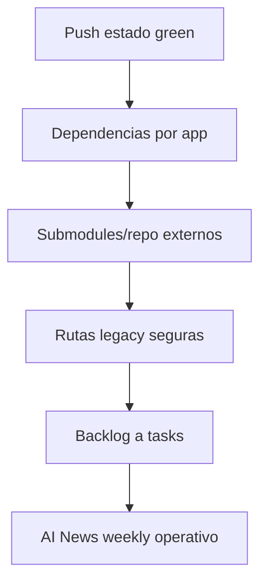

# Plan de Continuidad — Think Different PersonalOS v4.7

**Fecha:** 2026-05-22
**Estado base:** v4.1 SOTA audit green
**Último commit validado:** `795a1a67 fix: reconcile SOTA project audit state`
**Modo:** Plan primero, ejecución por fases con aprobación.

---

## 0. Principio Rector

No borrar información útil. Solo eliminar o reemplazar contenido cuando sea un bug confirmado, configuración rota, secreto, duplicado dañino o artefacto generado que bloquee el sistema.

Cada fase debe terminar con:

1. validación técnica,
2. resumen de cambios,
3. decisión de commit/push,
4. registro en Engram si hubo hallazgos, decisiones o fixes.

---

## 1. Estado Actual Confirmado

| Área | Estado | Evidencia |
|---|---:|---|
| Runtime OS | ✅ Green | `02_Playground/01_OS_Runtime_Test.py` → 20/20 |
| Skills | ✅ Green | 342 skills canónicas, 0 frontmatter faltante |
| Manifests | ✅ Green | `20_System_Mapper_Hub.py --validate` OK |
| AI News Skill | ✅ Green | Smoke test PDF/HTML/JSON/MD OK |
| Submodules | ✅ Sin fatal | `.gitmodules` reconciliado |
| Git | ⚠️ Ahead | `master` ahead de `origin/master` por 2 commits |
| Dependencias | ⚠️ Pendiente | Hay upgrades npm, varios major/breaking |

---

## 2. Fase A — Publicar Estado Green

**Objetivo:** asegurar que el estado v4.1 auditado quede respaldado remoto.

### Tareas

- [ ] Revisar `git status --short --branch`.
- [ ] Confirmar si se debe hacer `git push origin master`.
- [ ] Si se aprueba, hacer push de los 2 commits pendientes.
- [ ] Verificar remoto con `git log origin/master -n 3`.

### Criterio de salida

- `master` sincronizado con `origin/master` o decisión explícita de no empujar todavía.

---

## 3. Fase B — Modernización de Dependencias por App

**Objetivo:** actualizar dependencias sin romper proyectos activos.

### Orden recomendado

1. `.opencode/` — plugins de entorno, bajo riesgo.
2. `03_Resultado/09b_World_OIM/02_OIM_Website/` — app resultado activa.
3. `03_Resultado/09b_World_OIM/04_OIM_Website_Backup/` — backup funcional.
4. `01_Personal_Os/04_Operations/05_Projects/01_Projects_Lab/05_OBAND/` — Next/React actual.
5. `01_Personal_Os/04_Operations/05_Projects/01_Projects_Lab/06_OIM_Original/` — Vite/React con potencial major.
6. `01_Personal_Os/04_Operations/05_Projects/01_Projects_Lab/08_Elite_Portfolio/` — migración mayor probable: Next 14/React 18 → Next 16/React 19.
7. `01_Personal_Os/04_Operations/05_Projects/01_Projects_Lab/04_Macano_Rest/APP/frontend/` — Vite/React/Zod revisar por cambios breaking.

### Protocolo por app

- [ ] Capturar baseline: `npm outdated`, scripts disponibles, framework versions.
- [ ] Ejecutar validación base: `npm run lint`, `npm run build`, tests si existen.
- [ ] Hacer upgrades patch/minor primero.
- [ ] Separar major upgrades en rama/commit propio.
- [ ] Revalidar build/lint/tests.
- [ ] Documentar cambios y riesgos.

### Criterio de salida

- Cada app modernizada tiene build/lint/tests verdes o queda documentada con bloqueo concreto.

---

## 4. Fase C — Estrategia de Submodules / Repos Externos

**Objetivo:** decidir si los gitlinks actuales son submodules reales, copias locales o referencias históricas.

### Tareas

- [ ] Revisar estos gitlinks:
  - `01_Personal_Os/05_Archive/07_Repos_Gentleman/23_Tubemaster`
  - `01_Personal_Os/05_Archive/07_Repos_Gentleman/engram`
  - `01_Personal_Os/05_Archive/07_Repos_Gentleman/gentle-pi`
- [ ] Decidir por cada uno:
  - mantener como submodule,
  - inicializar contenido real,
  - convertir a carpeta normal versionada,
  - mover a archivo histórico documentado.
- [ ] Actualizar `01_Personal_Os/05_Archive/07_Repos_Gentleman/README.md`.

### Criterio de salida

- `git submodule status --recursive` no falla y la intención de cada repo externo está documentada.

---

## 5. Fase D — Rutas Legacy: Limpieza Segura

**Objetivo:** reducir referencias operativas legacy sin borrar historia.

### Tareas

- [ ] Ejecutar `audit_skills_routes.ps1` y `audit_skills_routes.py`.
- [ ] Clasificar resultados:
  - operativo activo,
  - documentación actual,
  - histórico/archivo,
  - test anti-regresión.
- [ ] Actualizar solo rutas operativas activas.
- [ ] Preservar `ROUTES.md`, tests anti-regresión y notas históricas.

### Criterio de salida

- No quedan rutas legacy en documentación operativa activa salvo listas de migración/anti-regresión explícitas.

---

## 6. Fase E — Backlog y Rutinas PersonalOS

**Objetivo:** convertir pendientes estratégicos en acciones ejecutables.

### P1

- [ ] **Elite Portfolio** — rediseño con Exaggerated Minimalism por secciones.
- [ ] **OIM Website** — verificación visual browser end-to-end.

### P2

- [ ] Pre-commit hook staged API keys.
- [ ] Onboarding nueva máquina.

### P3

- [ ] Automatizar reportes en `04_Operations/06_SOTA_Features/Reports_Planned/`.
- [ ] Revisar Workflows Marvel.
- [ ] Revisar Ritual de Cierre.
- [ ] Evaluar Avengers Plan.

### Criterio de salida

- Cada backlog item tiene archivo task con prioridad, contexto, definición de terminado y siguiente acción.

---

## 7. Fase F — Operacionalizar AI News Weekly

**Objetivo:** convertir la nueva skill en rutina recurrente útil.

### Tareas

- [ ] Ejecutar un reporte real de 7 días.
- [ ] Revisar calidad editorial, fuentes y deduplicación.
- [ ] Añadir sección estratégica: implicaciones para Product Design / AI Strategy.
- [ ] Definir si será semanal, diario o bajo demanda.
- [ ] Si se aprueba, crear automatización o checklist.

### Criterio de salida

- Primer briefing usable en `03_Resultado/NN_AI_News_Weekly_YYYYMMDD/`.

---

## 8. Secuencia Recomendada



---

## 9. Próxima Acción Recomendada

**Pedir aprobación para Fase A:** push de los 2 commits pendientes a `origin/master`.

Comando previsto si se aprueba:

```powershell
git push origin master
```

---

## 10. No hacer todavía

- No actualizar majors de dependencias sin plan por app.
- No borrar archivos históricos por contener rutas legacy.
- No convertir submodules a carpetas normales sin decisión explícita.
- No tocar proyectos visuales activos sin browser verification.
