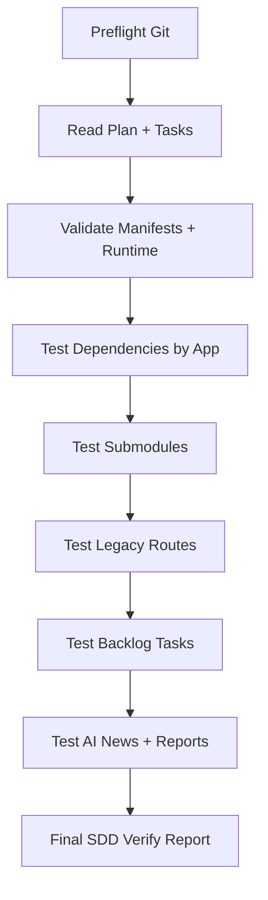

# SDD Plan — Probar Fases A-F del Plan de Continuidad

**Fecha:** 2026-05-22
**Proyecto:** Think_Different PersonalOS
**Modo:** SDD / solo planificación
**Objetivo:** probar de forma controlada todas las fases del `01_Personal_Os/03_Task/09_Plan_Seguir_2026-05-22.md` sin borrar información y sin mezclar cambios no verificados.


---

## 0.1 Estado Real Detectado — Auditoría 2026-05-22 15:45

> Esta sección actualiza el plan con lo que falta ahora mismo. No marca como válido ningún cambio hasta que pase por verificación.

### Estado Git observado

| Señal           | Cantidad / Estado                                            | Diagnóstico                                                                               |
|----------------|-------------------------------------------------------------|------------------------------------------------------------------------------------------|
| Branch          | `master...origin/master [ahead 1]`                           | Hay 1 commit local todavía no publicado o remoto no sincronizado en este clone.           |
| Deletes tracked | 284                                                          | Riesgo alto: hay muchas eliminaciones en skills de diseño/UI. No commitear sin clasificar.|
| Modified tracked| 2                                                            | `02_MCP_Registry.yaml` y submodule `gentle-pi`.                                           |
| Untracked       | 286                                                          | Parecen reubicaciones/renombres de skills + lockfile OIM + este plan SDD.                 |
| Submodule drift | `gentle-pi c3ce0a9f9 → 848a1fd62`                            | Decisión pendiente: actualizar puntero o revertir.                                        |
| Lockfile nuevo  | `03_Resultado/09b_World_OIM/02_OIM_Website/package-lock.json`| Decisión pendiente: trackear si corresponde al build activo.                              |

### Riesgo principal nuevo

Hay un patrón claro de **posible reorganización/renumeración de skills**:

- deletes en `02_Diseno_Ui_Ux/07_Ui_Ux_Pro_Max` y `08_Huashu_Design`,
- untracked en `02_Diseno_Ui_Ux/09_Huashu_Design`, `10_Dumbledor_Design`, `13_Design_Systems`,
- untracked en nuevas skills de `04_Automatizacion` y `06_Tools`,
- posible duplicación/renumeración de `System_Master`, `Silicon_Valley_Data_Analyst`, `AI_News_Weekly_Report`.

**Conclusión:** antes de probar builds o commitear, la Fase A debe ampliarse con una reconciliación de archivos: confirmar qué son renames legítimos, qué son copias nuevas y qué son eliminaciones accidentales.

### Nueva prioridad de ejecución

1. **P0 — Congelar y clasificar worktree:** nada de commit hasta explicar los 572 cambios.
2. **P0 — Resolver renames/deletes de skills:** usar `git status`, `git diff --name-status`, comparación por contenido y manifests.
3. **P1 — Resolver decisiones puntuales:** `gentle-pi`, `package-lock.json` de OIM, `02_MCP_Registry.yaml`.
4. **P1 — Revalidar manifests/skills:** solo después de clasificar archivos.
5. **P2 — Continuar builds/lint por app.**

---

## 0. Regla de Seguridad

No ejecutar cambios destructivos. No borrar información útil. Cada fase debe producir evidencia antes de marcarse como completada.

Todo avance debe terminar con:

1. estado Git revisado,
2. evidencia de validación,
3. lista de archivos tocados,
4. decisión explícita: commit / no commit / pendiente,
5. actualización del task correspondiente.

---

## 1. SDD Proposal

### Problema

El plan ya avanzó en varias fases, pero falta una validación sistemática que confirme qué está completo, qué quedó parcial y qué sigue bloqueado.

### Objetivo

Crear una matriz de pruebas para verificar:

- publicación y sincronía Git,
- dependencias por app,
- submodules/repos externos,
- rutas legacy,
- backlog convertido a tasks,
- AI News Weekly operativo,
- reports/onboarding/pre-commit derivados.

### No objetivos

- No hacer upgrades mayores automáticamente.
- No ejecutar migraciones visuales.
- No modificar proyectos activos sin build/lint/browser verification.
- No hacer force push.

---

## 2. SDD Spec — Requisitos de Validación

### REQ-01 — Git Clean State

**Como owner del OS**, quiero saber si el repo está limpio y sincronizado para evitar perder trabajo.

**Escenarios:**

- Dado el repo local, cuando se ejecute `git status --short --branch`, entonces debe indicar si hay cambios, submodules modificados o archivos sin trackear.
- Dado un submodule modificado, cuando se inspeccione, entonces debe decidirse si se commitea el puntero o se revierte.

### REQ-02 — Dependencias

**Como maintainer**, quiero validar upgrades por app sin romper builds.

**Escenarios:**

- Dada una app con `package.json`, cuando se revise su estado, entonces debe existir baseline de scripts, versiones y lockfile.
- Dado un upgrade patch/minor, cuando se ejecute build/lint, entonces debe pasar o registrar bloqueo concreto.
- Dado un upgrade major, entonces debe quedar diferido a branch/SDD propio.

### REQ-03 — Submodules / Repos Externos

**Como maintainer**, quiero que los gitlinks tengan intención clara.

**Escenarios:**

- Dado `git submodule status --recursive`, entonces no debe fallar.
- Dado un submodule con commit nuevo, entonces debe existir decisión documentada.

### REQ-04 — Rutas Legacy

**Como usuario del OS**, quiero que las rutas operativas apunten a la estructura actual.

**Escenarios:**

- Dado el auditor de rutas, cuando se ejecute en modo audit, entonces sus hallazgos deben clasificarse en operativo, histórico, docs o anti-regresión.
- Las rutas históricas pueden quedarse si están claramente marcadas como historial o migración.

### REQ-05 — Backlog a Tasks

**Como estratega**, quiero que cada pendiente tenga task accionable.

**Escenarios:**

- Cada P1/P2/P3 del plan debe tener archivo en `01_Personal_Os/03_Task/`.
- Cada task debe tener contexto, definición de terminado y siguiente acción.

### REQ-06 — AI News Weekly

**Como usuario**, quiero que AI News ya no sea solo skill sino rutina usable.

**Escenarios:**

- Dado el generador, cuando se ejecute reporte real de 7 días, entonces debe producir PDF/HTML/JSON/MD.
- El reporte debe incluir calidad editorial, fuentes, deduplicación e implicaciones estratégicas.

### REQ-07 — Reports / Onboarding / Pre-commit

**Como maintainer**, quiero cerrar las tareas operativas derivadas.

**Escenarios:**

- Reports debe tener estructura, templates/checklist y ubicación de outputs.
- Onboarding debe tener guía verificable para nueva máquina.
- Pre-commit API keys debe tener prueba con fake key bloqueada.

---

## 3. SDD Design — Estrategia de Pruebas

### Orden seguro



### Evidencia por fase

| Fase           | Evidencia mínima                       | Resultado esperado            |
|---------------|---------------------------------------|------------------------------|
| A Git          | `git status`, `git log`, remoto        | clean o pendientes claros     |
| B Deps         | package versions, lockfiles, build/lint| pass o bloqueo documentado    |
| C Submodules   | `git submodule status --recursive`     | sin fatal + decisión por drift|
| D Legacy Routes| audit scripts output                   | clasificación por tipo        |
| E Backlog      | tasks 10-17 revisados                  | todos accionables             |
| F AI News      | output real 7 días                     | reporte usable                |
| Extra Reports  | README/templates/output policy         | rutina clara                  |

---

## 4. SDD Tasks — Checklist de Ejecución

### 4.1 Preflight

- [ ] Confirmar repo activo: `C:\Users\sebas\Desktop\Think_Different`.
- [ ] Ejecutar `git status --short --branch`.
- [ ] Guardar lista de cambios locales sin modificar nada.
- [ ] Confirmar último commit local/remoto.

### 4.2 Fase A — Git / Publicación

- [ ] Verificar que `master` esté sincronizado con `origin/master`.
- [ ] Si hay cambios locales, clasificarlos:
  - [ ] submodule pointer,
  - [ ] lockfile,
  - [ ] docs,
  - [ ] generated output,
  - [ ] código real.
- [ ] Decidir commit/revert por cada item.

### 4.3 Fase B — Dependencias por App

#### `.opencode/`
- [ ] Revisar `package.json` y `package-lock.json`.
- [ ] Confirmar que upgrades patch/minor quedaron aplicados.
- [ ] Ejecutar validación disponible o documentar si no hay scripts.

#### `05_OBAND`
- [ ] Ejecutar `npm run lint`.
- [ ] Ejecutar `npm run build`.
- [ ] Confirmar que `lucide-react` major sigue diferido o validado.

#### `06_OIM_Original`
- [ ] Ejecutar `npm run lint`.
- [ ] Ejecutar `npm run build`.
- [ ] Confirmar que majors siguen diferidos.

#### `04_Macano_Rest/APP/frontend`
- [ ] Confirmar que `npm install` resolvió MISSING deps.
- [ ] Ejecutar `npm run build`.
- [ ] Registrar resultado.

#### `03_Resultado/09b_World_OIM/02_OIM_Website`
- [ ] Decidir si `package-lock.json` nuevo se trackea.
- [ ] Ejecutar `npm run lint`.
- [ ] Ejecutar `npm run build`.

#### `08_Elite_Portfolio`
- [ ] No migrar todavía.
- [ ] Crear SDD propio para Next 16 / React 19 / Tailwind 4.

### 4.4 Fase C — Submodules / Repos externos

- [ ] Ejecutar `git submodule status --recursive`.
- [ ] Revisar drift de `gentle-pi`.
- [ ] Decidir si actualizar puntero `gentle-pi` a `848a1fd62` o revertir.
- [ ] Confirmar que README de repos externos refleja la decisión.

### 4.5 Fase D — Rutas Legacy

- [ ] Ejecutar auditor de rutas en modo audit/dry-run.
- [ ] Clasificar hallazgos:
  - [ ] operativo activo,
  - [ ] documentación vigente,
  - [ ] histórico/archivo,
  - [ ] test anti-regresión.
- [ ] Marcar solo los operativos activos como candidatos a fix.

### 4.6 Fase E — Backlog a Tasks

- [ ] Verificar tasks `10` a `17`.
- [ ] Confirmar que cada task tiene:
  - [ ] objetivo,
  - [ ] contexto,
  - [ ] definición de terminado,
  - [ ] siguiente acción,
  - [ ] bloqueo si aplica.
- [ ] Actualizar `09_Plan_Seguir_2026-05-22.md` con checkboxes reales.

### 4.7 Fase F — AI News Weekly

- [ ] Ejecutar reporte real de 7 días.
- [ ] Verificar outputs en `03_Resultado/15_AI_News_Weekly_YYYYMMDD/`.
- [ ] Revisar fuentes y deduplicación.
- [ ] Añadir sección estratégica si falta.
- [ ] Decidir cadencia: semanal / diaria / bajo demanda.

### 4.8 Reports / Onboarding / Pre-commit

- [ ] Revisar `01_Personal_Os/04_Operations/10_Reports/README.md`.
- [ ] Definir templates mínimos para reports.
- [ ] Verificar `01_Setup_Guide.md` contra onboarding task.
- [ ] Probar hook con fake API key en commit controlado.

---

## 5. SDD Verify — Matriz de Resultado

Al terminar pruebas, crear un reporte con este formato:

| Fase        | Estado        | Evidencia       | Riesgo         | Siguiente acción|
|------------|--------------|----------------|---------------|----------------|
| A Git       | PASS/WARN/FAIL| comando + output| bajo/medio/alto| acción          |
| B Deps      | PASS/WARN/FAIL| build/lint      | bajo/medio/alto| acción          |
| C Submodules| PASS/WARN/FAIL| submodule status| bajo/medio/alto| acción          |
| D Legacy    | PASS/WARN/FAIL| audit output    | bajo/medio/alto| acción          |
| E Backlog   | PASS/WARN/FAIL| tasks           | bajo/medio/alto| acción          |
| F AI News   | PASS/WARN/FAIL| outputs         | bajo/medio/alto| acción          |

### Criterio para “100%”

El sistema se considera 100% probado cuando:

- [ ] Git está clean.
- [ ] No hay cambios locales sin decisión.
- [ ] Builds/lints críticos pasan o tienen bloqueo documentado.
- [ ] Submodules no fallan y drift está decidido.
- [ ] Plan y tasks reflejan estado real.
- [ ] AI News tiene un reporte real usable.
- [ ] Reports, onboarding y pre-commit tienen evidencia mínima.

---

## 6. Próxima Acción Recomendada

Ejecutar primero **Preflight + Fase A**, sin tocar código:

```powershell
git status --short --branch
git log --oneline --decorate --max-count=5
git diff --stat
git diff --submodule=log
```

Resultado esperado actual:

- `gentle-pi` aparece modificado.
- `03_Resultado/09b_World_OIM/02_OIM_Website/package-lock.json` aparece como untracked.

La primera decisión pendiente es:

1. ¿Actualizar puntero de `gentle-pi` o revertirlo?
2. ¿Trackear `package-lock.json` de OIM Website o ignorarlo?


---

## 7. Mejora SDD — Gate P0 de Reconciliación antes de ejecutar pruebas

Antes de ejecutar cualquier fase técnica, completar este gate:

### P0-GATE-01 — Snapshot sin modificar

- [x] Guardar salida de `git status --short --branch --untracked-files=all`.
- [x] Guardar salida de `git diff --name-status`.
- [x] Guardar salida de `git diff --cached --name-status`.
- [x] Contar deletes/modifies/untracked por carpeta.

### P0-GATE-02 — Clasificar cambios de skills

Para cada grupo:

| Grupo              | Acción de auditoría                                                              | Criterio                                                                         |
|-------------------|---------------------------------------------------------------------------------|---------------------------------------------------------------------------------|
| `02_Diseno_Ui_Ux`  | Detectar si `07/08` fueron renombrados a `09/10/13`                              | Si contenido coincide, tratar como rename; si no, preservar ambos hasta decisión.|
| `04_Automatizacion`| Detectar si nuevas skills son complementos o duplicados                          | Mantener si aportan capacidad nueva; fusionar solo si hay duplicado claro.       |
| `06_Tools`         | Revisar duplicados `18/22 System_Master`, `21/23 Silicon_Valley`, `23/24 AI News`| Evitar dos skills equivalentes con números distintos sin índice.                 |

### P0-GATE-03 — Actualizar manifests sin perder info

- [ ] Correr validadores solo después de clasificación.
- [ ] Si bajan los conteos de skills, bloquear y revisar deletes.
- [ ] Si suben los conteos, verificar que no sea duplicación accidental.

### P0-GATE-04 — Decisiones pendientes explícitas

- [x] `gentle-pi`: commit pointer a `848a1fd62` por fixes SDD/preflight recientes.
- [x] OIM `package-lock.json`: trackear para reproducibilidad del proyecto activo.
- [ ] `02_MCP_Registry.yaml`: revisar si cambio es timestamp/real drift.
- [x] `SDD_PLAN_PROBAR_FASES_2026-05-22.md`: mantener en raíz como artefacto SDD visible y vinculado desde plan operativo.

### P0-GATE-05 — Condición para pasar a Fase B

Solo pasar a dependencias/builds si:

- [ ] No hay deletes masivos sin explicación.
- [ ] No hay duplicados obvios de skills.
- [ ] `git status` muestra únicamente cambios intencionales.
- [ ] El plan `09_Plan_Seguir_2026-05-22.md` refleja el estado real.

### P0-GATE-06 — Resultado de reconciliación aplicado

- [x] Snapshot inicial revisado: el worktree real quedó reducido a cambios intencionales actuales, no a los 572 cambios del diagnóstico previo.
- [x] Duplicado exacto detectado y removido: `06_Tools/24_Ai_News_Weekly_Report/` era idéntico a `06_Tools/23_Ai_News_Weekly_Report/`.
- [x] Preservados cambios no equivalentes: nuevas skills de `04_Automatizacion`, `05_Workflows`, `06_Tools`, `15_Doc_Processing`, `System_Master`, `Silicon_Valley_Data_Analyst`, `Qmd`.
- [x] Manifests regenerados: total operativo actualizado a 393 skills, 12 áreas, 30 workflows, 28 HUBs, 152 scripts.
- [x] Documentación de conteos actualizada: `README.md`, `OS_DIRECTORY.md`, `CLAUDE.md`, `00_Winter_is_Coming/AGENTS.md`.


### VERIFY-01 — Evidencia final de ejecución

- [x] `python -m py_compile` sobre scripts Python nuevos de System Master → OK.
- [x] `python 01_Personal_Os/04_Operations/03_Scripts_Os/22_Validate_Skill_Frontmatter.py` → 393 skills con frontmatter, 0 faltantes.
- [x] `python 01_Personal_Os/04_Operations/03_Scripts_Os/20_System_Mapper_Hub.py --validate` → OK.
- [x] `python 02_Playground/01_OS_Runtime_Test.py` → 20/20 PASS.
- [x] `npm audit --omit=dev` en OIM Website → 0 vulnerabilities.
- [x] `npm run lint` en OIM Website → OK.
- [x] `npm run build` en OIM Website → OK.
- [x] `git submodule status --recursive` → sin fatal; submodules no inicializados históricos quedan como referencia, `gentle-pi` actualizado intencionalmente.
