# 🔧 Plan de Consolidación de Reglas: 23 → 10 Archivos

## ¿Qué estamos haciendo y por qué?

Actualmente PersonalOS tiene **23 archivos de reglas** (`.mdc`) que el agente de IA lee para saber cómo comportarse. El problema:

1. **Mucha repetición** — El mismo bloque de "Workspace Structure" se copia 23 veces (320 líneas de basura)
2. **Reglas duplicadas** — El protocolo Genesis se define en 2 archivos distintos, el AIPM en otros 2, etc.
3. **Gasto innecesario de tokens** — El agente carga ~92KB de texto cuando podría cargar ~55KB con la misma información

**Solución:** Agrupar las 23 reglas en **10 archivos** por área funcional, eliminando duplicados y repeticiones.

---

## 📍 Ubicaciones Afectadas

Las reglas viven en **DOS carpetas** que deben mantenerse sincronizadas:

```
Think_Different/
├── .agent/00_Rules/          ← 📌 Lo que LEE el agente (23 archivos hoy)
└── 01_Core/01_Rules/         ← 📌 Fuente de verdad (25 archivos hoy — tiene 2 extras)
```

> [!IMPORTANT]
> Ambas carpetas se consolidan **al mismo tiempo** con el mismo contenido.

---

## 🗺️ Mapa Visual: ANTES vs DESPUÉS

### ANTES: 23 archivos dispersos

```
.agent/00_Rules/
├── 01_Context_Protocol.mdc      ─┐
├── 17_Genesis.mdc                ─┤ 🔴 DUPLICADO: Ambos definen "inicio de sesión"
├── 21_Gentleman_Framework.mdc    ─┘

├── 02_Pilar_Base.mdc             ─┐
├── 05_Ritual_Integrity.mdc       ─┘ 🟡 Misma área: Seguridad del sistema

├── 03_Pilar_Motor.mdc            ── 🟢 Único (pero tiene secciones duplicadas internas)

├── 04_Pilar_Estrategia.mdc       ─┐
├── 08_Observability.mdc          ─┘ 🔴 DUPLICADO: Ambos definen AIPM, CoT, tokens

├── 09_Elite_Reporting.mdc        ── 🟢 Único (denso, merece archivo propio)

├── 10_Context_Management.mdc     ─┐
├── 11_Workflow_Standards.mdc     ─┤ 🟡 Misma área: Cómo opera el agente
├── 12_Nexus_Routing.mdc          ─┘

├── 06_Claude_Integration.mdc     ─┐
├── 07_Skill_Fusion.mdc           ─┤ 🟡 Misma área: Herramientas y Skills
├── 23_Skill_System_SOTA.mdc      ─┘

├── 13_Testing_Resource.mdc       ─┐
├── 14_Invoice_Intelligence.mdc   ─┤ 🟡 Misma área: Reglas de dominio específico
├── 22_Pencil_Design.mdc          ─┘

├── 18_Morning_Standup.mdc        ─┐
├── 20_Recap_Morning.mdc          ─┘ 🔴 DUPLICADO: Ambos son rituales matutinos

├── 15_Backlog_Processing.mdc     ─┐
├── 16_Brainstorming.mdc          ─┤ 🟡 Misma área: Workflows activables
├── 19_Planning.mdc               ─┘

├── README.md
├── RULES_INDEX.md
└── __Cursor_Rule_Skeleton.mdc
```

### DESPUÉS: 10 archivos limpios por área

```
.agent/00_Rules/
│
├── 01_Genesis_Protocol.mdc       🧬 El Arranque
├── 02_Security_Integrity.mdc     🛡️ El Escudo
├── 03_Engineering_Motor.mdc      🛠️ El Motor
├── 04_AIPM_Observability.mdc     🧠 La Mente
├── 05_Elite_Reporting.mdc        🏆 La Voz
├── 06_Context_Operations.mdc     🌐 El Sistema Nervioso
├── 07_Skills_Ecosystem.mdc       🔧 Los Exoesqueletos
├── 08_Domain_Specialists.mdc     🎯 Los Especialistas
├── 09_Daily_Rituals.mdc          ☀️ El Amanecer
├── 10_Workflows.mdc              🔄 Los Procesos
│
└── README.md                     📋 Índice + Workspace Structure (1 sola vez)
```

---

## 🎨 Diagrama de Fusiones

```mermaid
graph TB
    subgraph ANTES["📂 ANTES: 23 archivos"]
        direction TB
        A01["01_Context_Protocol"]
        A17["17_Genesis"]
        A21["21_Gentleman_Framework"]
        A02["02_Pilar_Base"]
        A05["05_Ritual_Integrity"]
        A03["03_Pilar_Motor"]
        A04["04_Pilar_Estrategia"]
        A08["08_Observability"]
        A09["09_Elite_Reporting"]
        A10["10_Context_Management"]
        A11["11_Workflow_Standards"]
        A12["12_Nexus_Routing"]
        A06["06_Claude_Integration"]
        A07["07_Skill_Fusion"]
        A23["23_Skill_System_SOTA"]
        A13["13_Testing_Resource"]
        A14["14_Invoice_Intelligence"]
        A22["22_Pencil_Design"]
        A18["18_Morning_Standup"]
        A20["20_Recap_Morning"]
        A15["15_Backlog_Processing"]
        A16["16_Brainstorming"]
        A19["19_Planning"]
    end

    subgraph DESPUES["📂 DESPUÉS: 10 archivos"]
        direction TB
        N01["🧬 01 Genesis Protocol"]
        N02["🛡️ 02 Security & Integrity"]
        N03["🛠️ 03 Engineering Motor"]
        N04["🧠 04 AIPM & Observability"]
        N05["🏆 05 Elite Reporting"]
        N06["🌐 06 Context & Operations"]
        N07["🔧 07 Skills Ecosystem"]
        N08["🎯 08 Domain Specialists"]
        N09["☀️ 09 Daily Rituals"]
        N10["🔄 10 Workflows"]
    end

    A01 --> N01
    A17 --> N01
    A21 --> N01
    A02 --> N02
    A05 --> N02
    A03 --> N03
    A04 --> N04
    A08 --> N04
    A09 --> N05
    A10 --> N06
    A11 --> N06
    A12 --> N06
    A06 --> N07
    A07 --> N07
    A23 --> N07
    A13 --> N08
    A14 --> N08
    A22 --> N08
    A18 --> N09
    A20 --> N09
    A15 --> N10
    A16 --> N10
    A19 --> N10
```



---

## 📘 DETALLE DE CADA ARCHIVO NUEVO

A continuación se detalla **exactamente** qué contenido va en cada archivo, de dónde viene, y qué se elimina.

---

### 📄 ARCHIVO 01 — `01_Genesis_Protocol.mdc`

**Identidad:** 🧬 El Arranque — Todo lo que pasa al iniciar una sesión  
**Fusiona:** `01_Context_Protocol` + `17_Genesis` + `21_Gentleman_Framework`  
**Líneas estimadas:** ~250  

#### Frontmatter exacto:
```yaml
---
description: "REGLA 01: Protocolo de Inicio de Sesión (Genesis), Idioma, Plan-First, Agent Teams, Reporting y SOTA Practices 2026"
globs: "**/*"
alwaysApply: true
---
```

#### Estructura interna — sección por sección:

| § | Título | Viene de... | Qué incluye | ¿Se eliminó algo? |
|:---:|:---|:---|:---|:---|
| §1 | **Protocolo de Inicio (Secuencia Obligatoria)** | 01 líneas 36-76 + 17 líneas 36-69 **FUSIONADOS** | Las Fases 1-4 de aterrizaje: Inventario → Memoria → Standup → Handshake. Se toma la versión más completa de cada fase entre ambos archivos | ✅ Se elimina la copia duplicada del archivo 17. El 01 tiene más detalle en la sección de SOTA, el 17 tiene mejor estructura de fases. Se combinan ambos en una sola versión definitiva |
| §2 | **Idioma Imperio** | 01 líneas 212-217 | Mandato de español obligatorio para toda comunicación, task.md, planes | ❌ Sin cambios — es contenido único |
| §3 | **Reporting 10%** | 01 líneas 148-168 | Formato `[XX%] Paso N/Total`, notificación por voz, campanilla al completar | ✅ Se elimina la copia duplicada que está en 17 líneas 73-98 (idéntico). Se elimina también la copia parcial en 04 y 08 |
| §4 | **Plan First** | 01 líneas 95-104 | Workflow obligatorio: pedir plan → pausar → revisar → luz verde | ✅ Se elimina la referencia duplicada en 04 línea 39 y 19 (que solo reitera el concepto) |
| §5 | **Agent Teams (Delegación Atómica)** | 01 líneas 173-186 | Uso mandatorio de sub-agentes, biblioteca de reglas, objetivo de ventana, aislamiento | ✅ Se elimina la referencia duplicada en 04 (que solo lo menciona de pasada) |
| §6 | **Monitoreo y Comunicación** | 01 líneas 190-202 | Reporte de progreso con %, ETA. Sub-agentes perpetuos (escuadrón de 5). Notificación por voz | ❌ Sin cambios — es contenido único de 01 |
| §7 | **SOTA Anthropic 2026** | 01 líneas 80-144 | 7 prácticas: CLAUDE.md, Plan then Execute, Custom Tools, Git Workflows, Specific Prompting, Context Management, Headless Mode | ❌ Sin cambios — es contenido único de 01 |
| §8 | **Gentleman Framework** | 21 completo (líneas 35-43) | 4 requisitos: Cargar contexto, Orquestador TDD, GGA, Engram MCP | ❌ Sin cambios — se mueve íntegro |
| §9 | **Referencias del Sistema** | 01 líneas 206-211 | ARCHIVO MAESTRO, MCPs activos, visibilidad de inventario | ❌ Sin cambios |
| §10 | **Checklist Consolidado** | 01 líneas 219-234 + 17 líneas 110-120 **FUSIONADOS** | Un solo checklist con todos los ítems únicos de ambas fuentes, eliminando los duplicados | ✅ Se eliminan los ítems que aparecían en ambos checklists |

#### ¿Qué se ELIMINA del archivo 01 original?
- Workspace Structure (líneas 17-31) → va a README.md
- Tags XML decorativos (`<system_directives>`, `<protocol_genesis>`, etc.) → se simplifican a headers markdown

#### ¿Qué se ELIMINA del archivo 17 original?
- **TODO** el contenido duplicado (Fases 1-4, Reporting, Campanilla, Checklist) → ya está en §1, §3, §10
- Workspace Structure → va a README.md

#### ¿Qué se ELIMINA del archivo 21 original?
- Workspace Structure → va a README.md
- El archivo completo se absorbe como §8

---

### 📄 ARCHIVO 02 — `02_Security_Integrity.mdc`

**Identidad:** 🛡️ El Escudo — Protección contra regresiones y eliminaciones  
**Fusiona:** `02_Pilar_Base` + `05_Ritual_Integrity`  
**Líneas estimadas:** ~130  

#### Frontmatter exacto:
```yaml
---
description: "REGLA 02: Seguridad del Sistema — Metodología Octopus (Redundancia Élite) + Integridad Ritual (Add-Only)"
globs: "**/*"
alwaysApply: true
---
```

#### Estructura interna — sección por sección:

| § | Título | Viene de... | Qué incluye |
|:---:|:---|:---|:---|
| §1 | **The Octopus (Redundancia Élite)** | 02 líneas 39-48 | Despliegue de 8 Tentáculos: 4 Forenses (investigan escenarios de ruptura) + 4 Ejecutores (implementan correcciones aisladas). Requisito Genesis para cada sub-agente |
| §2 | **Triggers Activos** | 02 líneas 52-63 | 3 triggers: Modificaciones masivas (lanza Octopus), Manejo de tipos críticos (usar tipado global), Null Shielding (bloquear null/undefined/NaN) |
| §3 | **Ritual Integrity: Add-Only** | 05 líneas 36-43 | 4 mandatos: PROHIBIDO eliminar, PROHIBIDO cambiar lo que funciona, Política de Solo Expansión, Fix the root cause sin borrar |
| §4 | **Ejemplos: Violaciones y Soluciones** | 02 líneas 55-57 + 05 líneas 48-66 | BAD: Reemplazo de código. GOOD: Expansión complementaria. Incluye ejemplos Python de ambos archivos |
| §5 | **Validación Humana** | 05 líneas 99-102 | Si crees que algo DEBE eliminarse → pedir permiso explícito al usuario |
| §6 | **Checklist Consolidado** | 02 líneas 68-73 + 05 líneas 108-115 | Checklist unificado: verificación de impacto colateral + preservación de código + numeración de pasos |

#### ¿Qué se ELIMINA?
- Workspace Structure de ambos archivos (02 líneas 17-31, 05 líneas 17-31)
- Sección "Propósito" de 02 (línea 36-37) → redundante con la `description` del frontmatter

---

### 📄 ARCHIVO 03 — `03_Engineering_Motor.mdc`

**Identidad:** 🛠️ El Motor — Stack técnico, estética y estándares de código  
**Fusiona:** Solo `03_Pilar_Motor` (limpieza interna)  
**Líneas estimadas:** ~120  

#### Frontmatter exacto:
```yaml
---
description: "REGLA 03: Estándares de Ingeniería — Stack Tecnológico, Armor Layer, Design Tokens, Premium UI y Vitaminización de Scripts"
globs: "**/*.{html,css,js,ts,tsx,py,md}"
alwaysApply: true
---
```

#### Estructura interna — sección por sección:

| § | Título | Viene de... | Qué incluye |
|:---:|:---|:---|:---|
| §1 | **Stack Tecnológico** | 03 líneas 38-39 | Vanilla First, no Tailwind, Premium UI |
| §2 | **Armor Layer (Blindaje)** | 03 líneas 41-43 | Rutas absolutas obligatorias, validación proactiva de archivos |
| §3 | **Design Tokens** | 03 líneas 64-73 | HSL Primary, Surface (glassmorphism), Radius, Lima, Azul Cobalto |
| §4 | **Organización de Skills** | 03 líneas 44-47 | Formato NN_Nombre_Skill, regla de 3 repeticiones → crear Skill |
| §5 | **Vitaminización de Scripts** | 03 línea 48 | Branding PersonalOS + notificaciones TTS en scripts de 03_Scripts_Os |
| §6 | **Pure Green Standard** | 03 línea 49 | Métricas 100% en rutas, dependencias, hooks |
| §7 | **Visibilidad de Progreso en Scripts** | 03 líneas 50-54 | Formato `[XX.X%] Paso N/Total`, TTS en hitos 25/50/75%, template disponible |
| §8 | **Integridad Matemática** | 03 líneas 55-57 | Centralización de constantes físicas, validación de curvas vs datos reales |
| §9 | **Código: Ejemplos BAD/GOOD** | 03 líneas 78-106 | Python (ruta relativa vs absoluta), CSS (plano vs glassmorphism) |
| §10 | **Checklist** | 03 líneas 147-155 | 6 ítems de verificación |

#### ¿Qué se ELIMINA del archivo 03 original?
- Workspace Structure (líneas 17-31)
- **Sección "Design Tokens" duplicada internamente** (aparece en líneas 64-73 Y de nuevo en líneas 125-131 como "Specific Project Patterns" → mismos datos). Se mantiene UNA sola vez
- Sección "When You Think You Need a Framework" (líneas 110-118) → esto ya lo dice §1 ("Vanilla First, no Tailwind"). Redundante
- Sección "Alternative Solutions" (líneas 136-142) → ya está cubierto en §7
- Referencia a Skill Fusion (línea 47: "Skill Fusion: usar siempre conocimiento oficial") → esto vive en Regla 07

---

### 📄 ARCHIVO 04 — `04_AIPM_Observability.mdc`

**Identidad:** 🧠 La Mente — Estrategia, razonamiento transparente, eficiencia  
**Fusiona:** `04_Pilar_Estrategia` + `08_Observability`  
**Líneas estimadas:** ~180  

#### Frontmatter exacto:
```yaml
---
description: "REGLA 04: AIPM & Observabilidad — Gestión Estratégica, CoT, Eficiencia de Tokens, Latencia y Perfección Geométrica"
globs: "**/*"
alwaysApply: true
---
```

#### Estructura interna — sección por sección:

| § | Título | Viene de... | Qué incluye | ¿Duplicado eliminado? |
|:---:|:---|:---|:---|:---|
| §1 | **Gestión Estratégica** | 04 líneas 38-40 | Contexto Atómico (una tarea = un chat — referencia a Regla 06 §1 para detalle), Ciclo de Tarea (Triage→Plan→Ejecución→Verificación→Aprendizaje), Golden Loop (referencia a Regla 06 §2) | ✅ "Contexto Atómico" ya no se explica aquí en detalle, solo referencia a Regla 06 donde vive completo. "Golden Loop" igual |
| §2 | **Observabilidad CoT** | 04 línea 42 + 08 líneas 38 | Visibilidad obligatoria del `thought_process`. Todo agente DEBE documentar su razonamiento | ✅ Se fusionan ambas versiones (casi idénticas) en una sola |
| §3 | **Las 4 C del Prompting** | 08 líneas 39-43 | Claro, Contexto, Constraints, Correctness/Examples | ❌ Contenido único del 08 |
| §4 | **Eficiencia de Tokens** | 04 líneas 43-45 + 08 líneas 44-47 **FUSIONADOS** | Ratio CoT/Response: objetivo 20%-50%. Over-thinking (>100%): simplificar. Superficialidad (<15%): profundizar. Registro granular `tokens_cot` vs `tokens_response` | ✅ Se eliminan las DOS versiones redundantes y se crea UNA definitiva con todo el detalle de ambas |
| §5 | **Latencia** | 04 línea 47 + 08 línea 48 **FUSIONADOS** | Umbral crítico 2000ms. Reportar proactivamente. Si recurrente → modelo más ligero o fragmentar tarea | ✅ Se eliminan DOS versiones, queda UNA |
| §6 | **Auditoría AIPM** | 08 líneas 49-51 | Pasar `16_aipm_evaluator.py`. Feedback debe explicar el "Por Qué" | ❌ Contenido único del 08 |
| §7 | **Perfección Geométrica** | 04 líneas 91-105 | Markdown: columnas fijas, columna ST aislada para emojis. Ejemplo BAD/GOOD con tabla | ❌ Contenido único del 04 |
| §8 | **Analítica de Dominio** | 04 línea 48 | Identificar dominio (Marketing, Salud, etc.), mostrar muestra real (Stripplot) | ❌ Contenido único del 04 |
| §9 | **Ejemplos BAD/GOOD** | 04 líneas 57-71 + 08 líneas 60-69 | BAD: Resultados mágicos, omitir CoT, ignorar latencia. GOOD: AIPM Senior execution con métricas y guardrails | ✅ Se fusionan ejemplos de ambos en una sola sección |
| §10 | **Checklist Consolidado** | 04 líneas 122-129 + 08 líneas 110-117 | Fusión de ambos checklists eliminando ítems duplicados | ✅ Eliminados 3 ítems que aparecían en ambos |

#### ¿Qué se ELIMINA del archivo 04 original?
- Workspace Structure (líneas 17-31)
- Explicación detallada de "Contexto Atómico" (línea 38) → vive en Regla 06 §1
- Explicación de "Golden Loop" (línea 40) → vive en Regla 06 §2
- Referencia a "Plan First" (duplicada desde Regla 01)
- Sección "Shortcuts" (líneas 76-84) → concepto ya cubierto en Regla 06 §1

#### ¿Qué se ELIMINA del archivo 08 original?
- Workspace Structure (líneas 17-31)
- Ratio tokens (líneas 44-47) → fusionado en §4
- Latencia (línea 48) → fusionado en §5
- Sección "Exceptions" (líneas 76-83) → concepto ya en §2
- Sección "Alternative Solutions" (líneas 99-103) → ya cubierto en §5

---

### 📄 ARCHIVO 05 — `05_Elite_Reporting.mdc`

**Identidad:** 🏆 La Voz — Estándar de reportes con storytelling y métricas  
**Fusiona:** Solo `09_Elite_Reporting` (limpieza interna)  
**Líneas estimadas:** ~250  

#### Frontmatter exacto:
```yaml
---
description: "REGLA 05: Elite Reporting Standard — Storytelling, Análisis Forense, Métricas Consolidadas (15-25) y Certificación de Estado"
globs: ["**/*.py", "**/*.md", "03_Scripts_Os/**/*"]
alwaysApply: true
---
```

#### Estructura interna — sección por sección:

| § | Título | Viene de... | Qué incluye |
|:---:|:---|:---|:---|
| §1 | **Storytelling Obligatorio** | 09 líneas 37-56 | Template Problema → Forense → Solución → Resultado (~200 palabras) |
| §2 | **Context Robbery Analysis** | 09 líneas 58-75 | Desglose: Ladrón Principal, Consumo por componente (tokens + %), Total |
| §3 | **Métricas Consolidadas (15-25)** | 09 líneas 77-87 | 6 herramientas: Trazas, Forense, Budget, RAG, Riesgos, Guardrails |
| §4 | **Problemas & Soluciones** | 09 líneas 88-96 | Formato: Concepto, Problema, Severidad (ALTA/MEDIA/BAJA), Solución |
| §5 | **Certificación de Estado** | 09 líneas 97-104 | ELITE GRADE (≥8.0), PRODUCTION READY (≥7.0), NEEDS IMPROVEMENT (<7.0) |
| §6 | **Estructura de Reporte Elite** | 09 líneas 110-187 | Template completo con todos los campos: ID, Timestamp, Métricas, Estado |
| §7 | **Ritual de Cierre** | 09 líneas 192-201 | Integración con `01_ritual_cierre.py`: generar reporte, certificar, actualizar notas |
| §8 | **Voz Activa Elite** | 09 líneas 206-214 | Declaración final en voz activa con emojis 🔱🏆🔋 |
| §9 | **Reglas de Oro** | 09 líneas 253-261 | 6 reglas: Narrativa > Métricas Secas, Forense Siempre, etc. |
| §10 | **Integración con Herramientas** | 09 líneas 267-288 | Scripts: `24_aipm_consolidated_report.py`, `01_ritual_cierre.py`, Process Notes |
| §11 | **Ejemplos CORRECTO/INCORRECTO** | 09 líneas 219-248 | Ejemplo completo de storytelling bueno vs resumen vacío |

#### ¿Qué se ELIMINA?
- Solo Workspace Structure (líneas 16-31). Este archivo es denso y autosuficiente, casi todo se preserva.

---

### 📄 ARCHIVO 06 — `06_Context_Operations.mdc`

**Identidad:** 🌐 El Sistema Nervioso — Cómo opera el agente en runtime  
**Fusiona:** `10_Context_Management` + `11_Workflow_Standards` + `12_Nexus_Routing`  
**Líneas estimadas:** ~200  

#### Frontmatter exacto:
```yaml
---
description: "REGLA 06: Contexto & Operaciones — Contexto Atómico, Golden Loop, Integridad de Inventario y Nexus Routing"
globs: "**/*"
alwaysApply: true
---
```

#### Estructura interna — sección por sección:

| § | Título | Viene de... | Qué incluye |
|:---:|:---|:---|:---|
| §1 | **Contexto Atómico** | 10 líneas 36-43 | Una Tarea = Un Chat. Evaluación de carga. Recomendación de reset. Briefing de cebado. Monitoreo de saturación (latencia, alucinación, ruido) |
| §2 | **Golden Loop** | 11 líneas 36-44 | Trazabilidad desde BACKLOG.md. Error→Regla (inyección). Memoria Persistente (Process Notes). Integridad de Inventario (audito físico con `ls`). Auto-Sanación de links rotos |
| §3 | **Diagrama del Golden Loop** | 11 líneas 50-62 | Diagrama Mermaid: Error→Analizar→Código→Regla→Sync→OK (se preserva íntegro) |
| §4 | **Nexus Routing Layer** | 12 líneas 36-49 | Clasificar dominio antes de actuar. Leer inventario antes de asumir. Lectura quirúrgica (NUNCA `ls -R`). Escalación: Agente→AIPM Judge→Orchestrator. Pure Green Standard |
| §5 | **Ejemplos BAD/GOOD** | 10 líneas 48-59 + 11 líneas 67-76 + 12 líneas 55-66 | Fusión de ejemplos: Historial infinito vs Saltos Atómicos, Conocimiento Volátil vs Memoria Persistente, Lectura Masiva vs Lectura Quirúrgica |
| §6 | **Checklist Consolidado** | 10 líneas 99-105 + 11 líneas 116-123 + 12 líneas 106-113 | Fusión de los 3 checklists: contexto puro + documentación + dominio clasificado |

#### ¿Qué se ELIMINA?
- Workspace Structure de los 3 archivos
- Sección "Shortcuts" de 10 (líneas 64-72) → ya cubierta por §1 (contexto atómico)
- Sección "When You Think You Don't Need Documentation" de 11 (líneas 82-89) → mismo concepto que §2
- Sección "When You Think You Need a Full Scan" de 12 (líneas 72-79) → ya cubierto en §4
- "Alternative Solutions" de los 3 archivos → conceptos ya integrados en las secciones principales
- "Specific Project Patterns" de los 3 → contenido demasiado vago, ya cubierto en las secciones

---

### 📄 ARCHIVO 07 — `07_Skills_Ecosystem.mdc`

**Identidad:** 🔧 Los Exoesqueletos — Todo sobre skills y herramientas externas  
**Fusiona:** `06_Claude_Integration` + `07_Skill_Fusion` + `23_Skill_System_SOTA`  
**Líneas estimadas:** ~350  

#### Frontmatter exacto:
```yaml
---
description: "REGLA 07: Skills Ecosystem — Claude Code Integration, Skill Fusion Protocol y Skill System Constitution (SOTA v2.0)"
globs: "**/*"
alwaysApply: true
---
```

#### Estructura interna — sección por sección:

| § | Título | Viene de... | Qué incluye |
|:---:|:---|:---|:---|
| §1 | **Claude Code Integration** | 06 líneas 36-43 | Slash commands por fase: PLANNING (/new-task, /feature-plan), EXECUTION (/code-cleanup, /code-optimize), POST-EXECUTION (/docs-generate, /sync-tutorials). Learning (/teach-me, /quiz-me) |
| §2 | **Skill Fusion Protocol** | 07 líneas 36-43 | Never Hallucinate Commands. Skill First Approach. Document Impact (Hito de Fusión). Context Guardians (Fork + Parallel) |
| §3 | **Mapa de Poder** | 07 líneas 48-57 | Tabla: Arquitectura/React→vercel, Diseño→ui-ux-pro-max, Backend→prisma/supabase, DevOps→docker/vercel |
| §4 | **Skill System Constitution** | 23 líneas 16-17 + 33-88 | Estructura de archivos de una Skill (SKILL.md, references/, scripts/, assets/, examples/). Frontmatter obligatorio (YAML). Requisitos de descripción |
| §5 | **Las 9 Categorías Anthropic** | 23 líneas 92-107 | Tabla completa: Library, Product Verification, Data Fetching, Business Process, Code Scaffolding, Code Quality, CI/CD, Runbooks, Infrastructure Ops |
| §6 | **Seguridad de Skills** | 23 líneas 110-136 | skill_security_scan.py. Niveles: CRITICAL (bloquear), HIGH (revisión manual), MEDIUM (corrección), LOW (informativo). 5 reglas de seguridad |
| §7 | **Sistema de Scoring** | 23 líneas 139-190 | Modelo: 25% Completitud + 30% Calidad + 25% Seguridad + 20% Documentación. Rangos: Excellent (90+), Good (70-89), Needs Work (50-69), Failed (<50) |
| §8 | **Ciclo de Vida** | 23 líneas 193-240 | 5 fases: Planning→Creation→Validation→Publication→Monitoring. Diagrama ASCII preservado |
| §9 | **SKILL_TEMPLATE** | 23 líneas 243-273 | Template oficial en `01_Core/03_Skills/SKILL_TEMPLATE/`. Uso y estructura |
| §10 | **Agent Teams Lite (Sub-Skills SDD)** | 23 líneas 277-302 | 10 sub-skills: sdd-init→sdd-archive. Tabla con función y requerimiento de examples/ |
| §11 | **Ejemplos BAD/GOOD** | 06 líneas 49-60 + 07 líneas 62-76 + 23 líneas 306-354 | Fusión de ejemplos de los 3 archivos: comandos inventados, descripciones vagas, sin examples/, sin security scan |
| §12 | **Checklist Consolidado** | 06 líneas 100-106 + 07 líneas 115-122 + 23 líneas 358-369 | Checklist unificado: slash commands + exoesqueletos + anatomía + seguridad + scoring |

#### ¿Qué se ELIMINA?
- Workspace Structure de los 3 archivos
- Sección "When You Think You Know the Command" de 07 (líneas 81-88) → ya cubierto en §2
- Sección "When You Think You Need Manual Documentation" de 06 (líneas 66-73) → cubierto en §1
- "Alternative Solutions" de 06 y 07 → contenido genérico ya integrado
- "Specific Project Patterns" de 06 y 07 → contenido ya en §1 y §4
- Referencia cruzada interna `07_Skill_Fusion.mdc` en 23 (línea 375) → se actualiza a `07_Skills_Ecosystem.mdc`

---

### 📄 ARCHIVO 08 — `08_Domain_Specialists.mdc`

**Identidad:** 🎯 Los Especialistas — Reglas de dominio que NO siempre aplican  
**Fusiona:** `13_Testing_Resource` + `14_Invoice_Intelligence` + `22_Pencil_Design`  
**Líneas estimadas:** ~180  

#### Frontmatter exacto:
```yaml
---
description: "REGLA 08: Reglas de Dominio — Testing/Hardware (Skill 48), Invoice Intelligence (OCR) y Pencil Design Studio"
globs: ["**/*.test.*", "**/*.spec.*", "**/Invoice*/**", "**/*.{html,css,svg,png,jpg}"]
alwaysApply: false
---
```

> [!NOTE]
> Este archivo tiene `alwaysApply: false` porque sus reglas solo aplican cuando se trabaja con tests, facturas o diseño. No se carga siempre.

#### Estructura interna — sección por sección:

| § | Título | Viene de... | Qué incluye |
|:---:|:---|:---|:---|
| §1 | **Testing & Hardware (Skill 48)** | 13 líneas 36-44 | Limit workers: `--maxWorkers=4` (Vitest, Playwright, Jest). Monitor CPU < 90%. Cleanup hooks obligatorios |
| §2 | **Ejemplos Testing** | 13 líneas 50-68 | BAD: `npx vitest` sin límites. GOOD: `npx vitest --maxWorkers=4`. "When You Think You Need More Power" |
| §3 | **Invoice Intelligence (OCR)** | 14 líneas 36-45 | Armor Layer para rutas. Workers para lotes > 5 archivos. Pipeline: pdfplumber (nativo) → Tesseract (fallback si < 100 chars). Exportar tríada: CSV, Excel, JSON. Archivado en `processed/YYYY-MM/` |
| §4 | **Ejemplos Invoice** | 14 líneas 50-75 | BAD: rutas relativas + OCR innecesario. GOOD: rutas absolutas + fallback inteligente |
| §5 | **Pencil Design Studio** | 22 líneas 36-56 | MCP Pencil (`@open-pencil/mcp`): `pencil_create_page`, `pencil_add_component`, `pencil_export`. Estándar: Glassmorphism, HSL, bordes 0.1 alpha. Triggers: "Rediseña...", "Crea componente...", "Aplica estilo Pencil..." |
| §6 | **Checklist por Dominio** | 13 líneas 107-112 + 14 líneas 102-109 + 22 (sin checklist original, se crea uno) | 3 mini-checklists separados, uno por dominio |

#### ¿Qué se ELIMINA?
- Workspace Structure de los 3 archivos
- "Alternative Solutions" de 13 y 14 → integrados en las secciones principales
- "Specific Project Patterns" de 13 y 14 → contenido genérico ya cubierto

---

### 📄 ARCHIVO 09 — `09_Daily_Rituals.mdc`

**Identidad:** ☀️ El Amanecer — Rituales matutinos  
**Fusiona:** `18_Morning_Standup` + `20_Recap_Morning`  
**Líneas estimadas:** ~120  

#### Frontmatter exacto:
```yaml
---
description: "REGLA 09: Rituales Diarios — Morning Standup (The Big 3) y Recap Planning (Fireflies + Prioridades)"
globs: "**/*"
alwaysApply: true
---
```

#### Estructura interna — sección por sección:

| § | Título | Viene de... | Qué incluye |
|:---:|:---|:---|:---|
| §1 | **Morning Standup** | 18 líneas 36-50 | Ejecutar `python 03_Scripts_Os/Ritual_Fixed/14_Morning_Standup.py`. El script lee inventario, CTX, Process Notes, tareas activas. Genera "The Big 3" |
| §2 | **Presentar Reporte** | 18 líneas 51-71 | Formato: Fecha, Objetivo Principal, THE BIG 3 (3 tareas), Estado (P0/P1 activas, bloqueos), Recordatorio de 10% reporting |
| §3 | **Recap & Planning Avanzado** | 20 líneas 36-43 | Sincronización Fireflies: `python 03_Scripts_Os/Ritual_Fixed/39_Recap_Planning.py`. Revisión de prioridades vía MCP. Análisis de bloqueos (status `b`). Victorias Rápidas (baja fricción) |
| §4 | **Salida Estructurada del Recap** | 20 líneas 49-57 | Formato: Resumen Fireflies, Objetivo Principal ("Norte"), Top 3 Tasks (con links), Victorias Rápidas, Housekeeping, ¿En qué trabajar primero? |
| §5 | **Criterios de Priorización** | 18 líneas 84-93 | Tabla P0-P3: P0 (MUST DO THIS WEEK), P1 (THIS MONTH), P2 (SCHEDULED), P3 (BACKLOG) |
| §6 | **Integración con Goals** | 18 líneas 98-104 | Cada tarea del Big 3 DEBE vincularse con GOALS.md, citar heading, medir contra métricas |
| §7 | **Verificación de Capacidad** | 18 líneas 73-78 | Preguntar al usuario si plan es realista, confirmar compromisos externos, ajustar Big 3 |

#### ¿Qué se ELIMINA?
- Workspace Structure de ambos
- Script 18 dice `"Ejecutar Script (Automático)"` y script 20 dice `"Sincronización Fireflies"` → ambos son pasos de un mismo flujo matutino. Se unifican en §1-§3 como un solo ritual con 2 variantes
- Referencia a script `14_Morning_Standup.py` aparece en 18 → se preserva en §1

---

### 📄 ARCHIVO 10 — `10_Workflows.mdc`

**Identidad:** 🔄 Los Procesos — Workflows activables por el usuario  
**Fusiona:** `15_Backlog_Processing` + `16_Brainstorming` + `19_Planning`  
**Líneas estimadas:** ~100  

#### Frontmatter exacto:
```yaml
---
description: "REGLA 10: Workflows Activables — Backlog Processing, Spider Brainstorm y Professor X (Strategic Planning)"
globs: "**/*"
alwaysApply: false
---
```

> [!NOTE]
> `alwaysApply: false` porque estos workflows solo se activan cuando el usuario los pide explícitamente ("procesar backlog", "brainstorm", "planifica X").

#### Estructura interna — sección por sección:

| § | Título | Viene de... | Qué incluye |
|:---:|:---|:---|:---|
| §1 | **Backlog Processing** | 15 líneas 36-48 | 7 pasos: Lectura → Búsqueda de Contexto → Deduplicación → Clasificación (technical/outreach/research/writing/admin/personal) → Priorización (P0-P3) → Clarificación (si ambiguo, preguntar) → Creación de tareas → Resumen Final |
| §2 | **Tips de Backlog** | 15 líneas 53-58 | Brevedad, agrupar por "Listos/Necesitan aclaración/Posibles duplicados", vincular con GOALS.md |
| §3 | **Spider Brainstorm** | 16 líneas 36-43 | 4 fases: Divergencia (captura total sin juicio) → Mapeo Mental (nodos temáticos, conexiones no obvias) → Convergencia (filtro Dieter Rams + GOALS.md) → Selección Elite (3 mejores rutas) |
| §4 | **Herramientas de Brainstorm** | 16 líneas 48-53 | Sub-agentes para investigar (Exa). Mermaid para visualizar. Técnica de los "5 Porqués" |
| §5 | **Professor X (Strategic Planning)** | 19 líneas 37-43 | 5 puntos: Definición de Éxito (DoD), Análisis de Riesgos (Breaking Changes), Arquitectura de la Solución (stack + componentes + flujo), Pasos de Ejecución (atómicos con verificación), Estrategia de Sub-agentes |
| §6 | **Regla de Oro** | 19 líneas 49-53 | PLAN FIRST: nunca código sin plan aprobado. Verificación paso a paso |

#### ¿Qué se ELIMINA?
- Workspace Structure de los 3 archivos
- "Plan First" de 19 → solo se deja la referencia (ya está como concepto principal en Regla 01 §4)

---

## 🔴 Ejemplos concretos de contenido duplicado eliminado

### Ejemplo 1: Workspace Structure (se repite 23 veces)
```
Este bloque IDÉNTICO aparece en CADA archivo:

├── 00_Winter_is_Coming/    # Goals, Backlog, Memoria
├── 01_Core/               # Motor: Skills, Agents, MCPs
├── 02_Knowledge/          # Documentación
...etc (14 líneas × 23 archivos = 320 líneas de basura)

✅ SOLUCIÓN: Se pone UNA SOLA VEZ en README.md
```

### Ejemplo 2: Protocolo Genesis (01 vs 17)
```
ARCHIVO 01 dice:                        ARCHIVO 17 dice:
"Leer Inventario Total"                 "Leer Inventario Total"          ← IGUAL
"Leer Goals"                            "Leer Goals"                     ← IGUAL
"Leer Backlog"                          "Leer Backlog"                   ← IGUAL
"Leer Reglas"                           "Leer Reglas"                    ← IGUAL
"Ejecutar Morning Standup"              "Ejecutar Morning Standup"       ← IGUAL
"Reportar Handshake"                    "Reportar Handshake"             ← IGUAL

✅ SOLUCIÓN: Se fusionan en UN SOLO §1 dentro de 01_Genesis_Protocol.mdc
```

### Ejemplo 3: AIPM + Tokens (04 vs 08)
```
ARCHIVO 04 dice:                        ARCHIVO 08 dice:
"Ratio CoT/Response 20%-50%"            "Ratio 20%-50%"                  ← IGUAL
"Latencia 2000ms"                       "2000ms umbral"                  ← IGUAL
"Over-thinking > 100%"                  "Over-thinking > 100%"           ← IGUAL

✅ SOLUCIÓN: Se fusionan en UN SOLO 04_AIPM_Observability.mdc
```

---

## 🔗 Conexiones con Scripts y Docs

### Scripts ACTIVOS que hay que actualizar:

| Script | Línea | Qué dice ahora | Qué debe decir |
|:---|:---:|:---|:---|
| `03_Scripts_Os/15_SOTA_Integrity_Check.py` | 12 | `Rules (25)` | `Rules (10)` |
| `03_Scripts_Os/15_SOTA_Integrity_Check.py` | 177 | `CHECKING: Rules (25)` | `CHECKING: Rules (10)` |
| `03_Scripts_Os/15_SOTA_Integrity_Check.py` | 196 | `return len(mdc_files) >= 24` | `return len(mdc_files) >= 10` |

### Scripts LEGACY (NO necesitan actualización):

| Script | Ubicación | Por qué NO se toca |
|:---|:---|:---|
| `32_Multi_Agent_Final_Validation.py` | `10_Legacy/` | Apunta a `.cursor/00_Rules` (obsoleto) |
| `87_Iron_Man_Gen.py` | `10_Legacy/` | Apunta a `.cursor/00_Rules` (obsoleto) |
| `06_AntMan_Lfg_Lite.py` | `10_Legacy/` | Apunta a `.cursor/01_Rules` (obsoleto) |
| `07_Doc_Strange_Lfg.py` | `10_Legacy/` | Apunta a `.cursor/01_Rules` (obsoleto) |

### Documentación a actualizar:

| Archivo | Cambio necesario |
|:---|:---|
| `04_Operations/04_Memory_Brain/00_Active/01_Reglas_Sistema.md` | `01_Context_Protocol.mdc` → `01_Genesis_Protocol.mdc` |
| `06_Playground/04_Maerks/08_SOP_Prompts/02_Prompt_01_Rules.md` | Actualizar nombres de reglas citadas |
| `06_Playground/04_Maerks/08_SOP_Prompts/01_Prompt_00_Workflows.md` | `01_Context_Protocol.mdc` y `03_Pilar_Motor.mdc` → nombres nuevos |
| `.agent/00_Rules/README.md` | Reescribir como índice de 10 reglas |
| `01_Core/01_Rules/README.md` | Reescribir como índice de 10 reglas |

---

## 🚀 Pasos de Ejecución

### Paso 0: Crear Backup 🔒

```
Copiar:
  .agent/00_Rules/     → 05_Archive/00_Rules_Legacy_Agent/
  01_Core/01_Rules/    → 05_Archive/00_Rules_Legacy_Core/
```
**Verificación:** ¿Las carpetas backup tienen todos los archivos originales? ✅

### Paso 1: Crear 10 archivos nuevos en `.agent/00_Rules/`
Crear cada archivo con su frontmatter y contenido según el detalle de arriba.

### Paso 2: Actualizar README.md en `.agent/00_Rules/`
Reescribir como índice de 10 reglas + Workspace Structure (única copia).

### Paso 3: Copiar los 10 .mdc + README a `01_Core/01_Rules/`
Mismo contenido exacto en ambas carpetas.

### Paso 4: Eliminar archivos viejos de ambas carpetas
Los 23+ .mdc originales + RULES_INDEX.md + __Cursor_Rule_Skeleton.mdc

### Paso 5: Actualizar `15_SOTA_Integrity_Check.py` (3 líneas)

### Paso 6: Actualizar documentación con referencias rotas (5 archivos)

### Paso 7: Verificación Final
```
✅ .agent/00_Rules/: 10 .mdc + 1 README = 11 archivos
✅ 01_Core/01_Rules/: 10 .mdc + 1 README = 11 archivos
✅ Contenido idéntico en ambas carpetas
✅ 15_SOTA_Integrity_Check.py valida >= 10
✅ Sin referencias rotas a nombres viejos
✅ Backup existe en 05_Archive/
```

---

## 📐 Arquitectura Final

```
.agent/00_Rules/                         01_Core/01_Rules/
├── README.md           📋 Índice        ├── README.md
├── 01_Genesis_Protocol.mdc    🧬        ├── 01_Genesis_Protocol.mdc
├── 02_Security_Integrity.mdc  🛡️        ├── 02_Security_Integrity.mdc
├── 03_Engineering_Motor.mdc   🛠️        ├── 03_Engineering_Motor.mdc
├── 04_AIPM_Observability.mdc  🧠        ├── 04_AIPM_Observability.mdc
├── 05_Elite_Reporting.mdc     🏆        ├── 05_Elite_Reporting.mdc
├── 06_Context_Operations.mdc  🌐        ├── 06_Context_Operations.mdc
├── 07_Skills_Ecosystem.mdc    🔧        ├── 07_Skills_Ecosystem.mdc
├── 08_Domain_Specialists.mdc  🎯        ├── 08_Domain_Specialists.mdc
├── 09_Daily_Rituals.mdc       ☀️        ├── 09_Daily_Rituals.mdc
└── 10_Workflows.mdc           🔄        └── 10_Workflows.mdc
(11 archivos · ~55KB)                    (11 archivos · ~55KB)
```

---

## 📊 Resumen de Impacto

| Métrica | Antes | Después | Cambio |
|:---|:---:|:---:|:---:|
| Archivos `.mdc` por carpeta | 23-25 | 10 | **−57%** |
| Tamaño total | ~92KB | ~55KB | **−40%** |
| Líneas repetidas (Workspace Structure) | 320+ | 0 | **−100%** |
| Solapamientos de contenido | 15+ | 0 | **−100%** |
| Archivos `alwaysApply: true` | 18 | 7 | **−61%** |
| Scripts activos a actualizar | — | 1 | mínimo |
| Docs a actualizar | — | 5 | menor |
