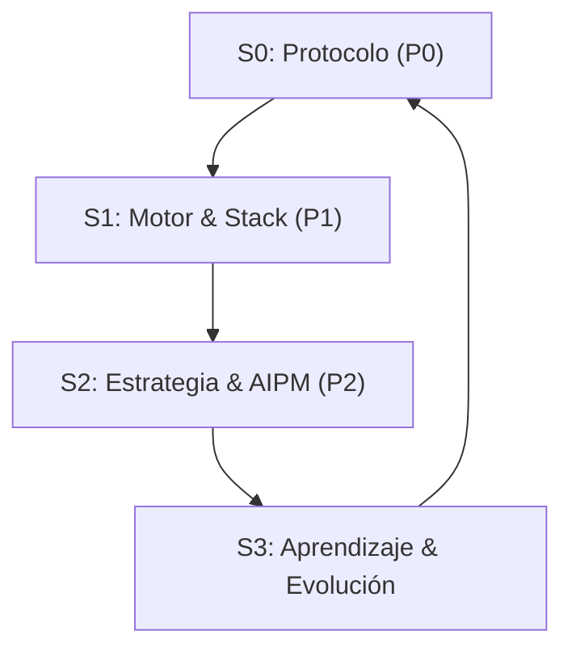

# Filosofía de Trabajo: La Tríada AI-Prime 🔱

Este directorio contiene la inteligencia operativa de **PersonalOS**, consolidada en **3 Pilares Cognitivos** para maximizar la eficiencia y precisión del asistente.

## 🏛️ Estructura de Poder

1.  **[🔘 Pilar 0: Protocolo](01_Pilares_Sistema.mdc):** Pilares fundamentales del sistema
2.  **[🛠️ Pilar 1: Motor](02_Motor_Agent.mdc):** Motor y stack técnico, Agent Integration
3.  **[🧠 Pilar 2: Estrategia](03_Protocolos_Ejecucion.mdc):** Protocolos de ejecución y gestión

## 📋 Índice de Reglas (12 archivos)

| #  | Regla                         | Propósito                                |
| --- | ----------------------------- | ---------------------------------------- |
| 00 | `00_Core_Protocol.mdc`        | Protocolo core — ADN operativo           |
| 01 | `01_Pilares_Sistema.mdc`      | Pilares fundamentales del sistema        |
| 02 | `02_Motor_Agent.mdc`          | Motor, Agent Integration y Stack Técnico |
| 03 | `03_Protocolos_Ejecucion.mdc` | Protocolos de ejecución                  |
| 04 | `04_Observabilidad.mdc`       | Observabilidad y monitoreo               |
| 05 | `05_Reporting.mdc`            | Reporting de élite                       |
| 06 | `06_Contexto_Gestion.mdc`     | Gestión de contexto                      |
| 07 | `07_Docs_Guias.mdc`           | Documentación y guías                    |
| 08 | `08_Token_Economy.mdc`        | Economía de tokens                       |
| 09 | `09_Agent_Teams_Protocol.mdc` | Protocolo de Agent Teams                 |
| 10 | `10_Git_Directions.mdc`       | Direcciones Git y flujo de trabajo       |
| 11 | `11_Minimax.mdc`              | Configuración Minimax                    |

## 🔄 El Bucle de Oro (The Golden Loop)

El sistema opera bajo un flujo circular que asegura que cada acción sea estratégica:

- **ADN (Pilar 0)**: Define el Protocolo.
- **Músculo (Pilar 1)**: Ejecuta con el Motor.
- **Cerebro (Pilar 2)**: Orquesta la Estrategia.

> ⚠️ **Nota:** Este es el stack LEGACY de `.agent/00_Rules/`. El stack activo actual vive en `.claude/02_Rules/` con 22 archivos numerados (01-22 + Cursor_Rule_Skeleton).

---

_ "El código es temporal, los Pilares son eternos." _