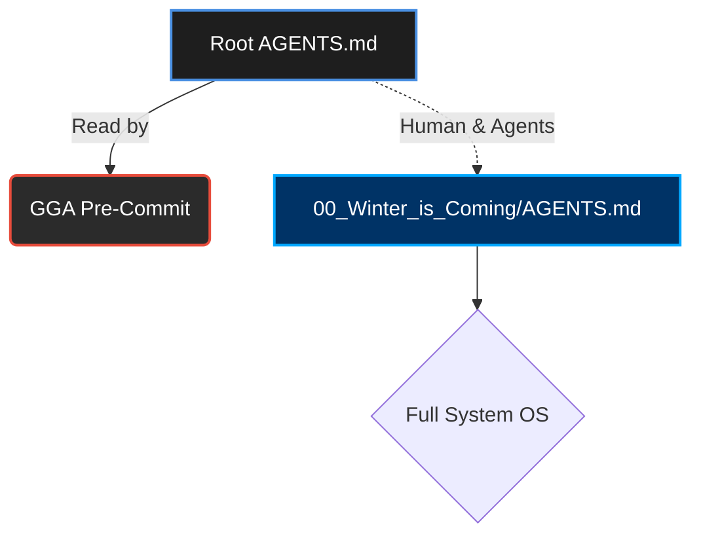

# 🛡️ Guardian Angel Entrypoint (GGA)

> [!CAUTION]
> **SYSTEM REDIRECT:** The main agent rules and OS capabilities are located in the [Matrix Core (Winter is Coming)](00_Winter_is_Coming/AGENTS.md).
> This file exists in the root **exclusively** as a configuration loader for the **GGA (Guardian Angel) Pre-Commit Hook**.

---

## 🧭 Flow & Architecture

---

## ⚡ Code Review Rules (For GGA)

> [!IMPORTANT]
> The following rules must be enforced by Guardian Angel on every commit constraint check.

### Environment Detection (ALWAYS ACTIVE)
- ✅ **Detect IDE/Terminal**: When starting work or reading files, identify what environment is being used (Cursor, VS Code, Terminal, etc.)
- ✅ **Research Capabilities**: Understand the native features, shortcuts, and limitations of the detected environment
- ✅ **Leverage Native Tools**: Use built-in browser, terminal, or IDE features instead of external tools when available

### TypeScript / JavaScript
- ✅ **Use `const` or `let`**.
- ❌ **NEVER use `var`**.
- ✅ **Prefer `interfaces` over `types`** for object structures.
- ❌ **No `any` types allowed** under any circumstances (Strict typing).

### React / Frontend
- ✅ **Use Functional Components** exclusively.
- ✅ **Prefer Named Exports** over default exports to ensure predictable refactoring and IntelliSense.

---
*Generated by Think Different PersonalOS v4.9 Consequences — Production Ready (2026-05-28)*

## graphify

This project has a knowledge graph at Graphify_Out/ with god nodes, community structure, and cross-file relationships.
- For codebase questions, first run `graphify query "<question>"` when Graphify_Out/graph.json exists. Use `graphify path "<A>" "<B>"` for relationships and `graphify explain "<concept>"` for focused concepts. These return a scoped subgraph, usually much smaller than GRAPH_REPORT.md or raw grep output.
- Dirty Graphify_Out/ files are expected after hooks or incremental updates; dirty graph files are not a reason to skip graphify. Only skip graphify if the task is about stale or incorrect graph output, or the user explicitly says not to use it.
- If Graphify_Out/wiki/index.md exists, use it for broad navigation instead of raw source browsing.
- Read Graphify_Out/GRAPH_REPORT.md only for broad architecture review or when query/path/explain do not surface enough context.
- After modifying code, run `graphify update .` to keep the graph current (AST-only, no API cost).
