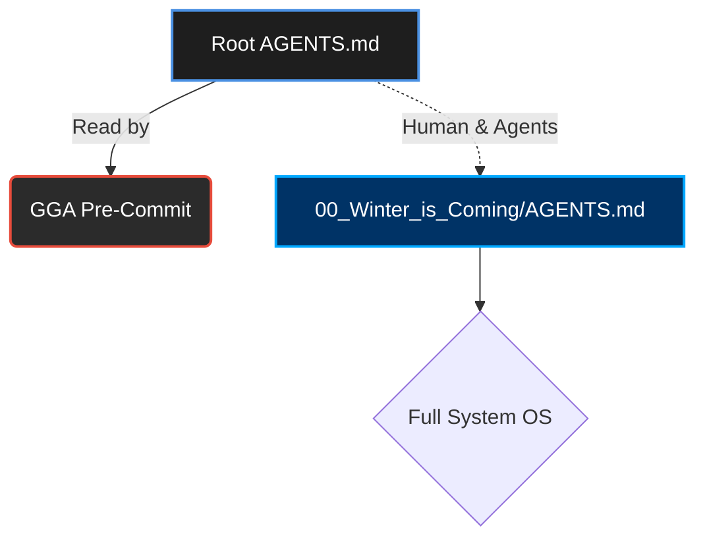

# 🛡️ Guardian Angel Entrypoint (GGA)

> [!CAUTION]
> **SYSTEM REDIRECT:** The main agent rules and OS capabilities are located in the [Matrix Core (Winter is Coming)](00_Winter_is_Coming/AGENTS.md).
> This file exists in the root **exclusively** as a configuration loader for the **GGA (Guardian Angel) Pre-Commit Hook**.

---

## 🧭 Flow & Architecture

---

## ⚡ Code Review Rules (For GGA)

> [!IMPORTANT]
> The following rules must be enforced by Guardian Angel on every commit constraint check.

### Environment Detection (ALWAYS ACTIVE)
- ✅ **Detect IDE/Terminal**: When starting work or reading files, identify what environment is being used (Cursor, VS Code, Terminal, etc.)
- ✅ **Research Capabilities**: Understand the native features, shortcuts, and limitations of the detected environment
- ✅ **Leverage Native Tools**: Use built-in browser, terminal, or IDE features instead of external tools when available

### TypeScript / JavaScript
- ✅ **Use `const` or `let`**.
- ❌ **NEVER use `var`**.
- ✅ **Prefer `interfaces` over `types`** for object structures.
- ❌ **No `any` types allowed** under any circumstances (Strict typing).

### React / Frontend
- ✅ **Use Functional Components** exclusively.
- ✅ **Prefer Named Exports** over default exports to ensure predictable refactoring and IntelliSense.

---
*Generated by Think Different PersonalOS v5.0 SOTA — Production Ready (2026-07-03)*

## 🛠️ Nuevas Herramientas CLI (v5.0 SOTA)

| Comando | Descripción |
|---------|-------------|
| `python config_paths.py --validate` | Valida 82/82 paths del sistema, exit 0 si OK |
| `python config_paths.py --validate --json` | Idem en JSON machine-parseable |
| `python sync_copies.py --dry-run` | Reporta drift entre Copy A y Copy B |
| `python sync_copies.py --apply` | Sincroniza B→A con backup automático |

## 📚 Reference Repos (READ ON BOOT)

> [!NOTE]
> When reading the project context, also consult these upstream reference repos for methodology alignment:

| Repo | Location | Purpose |
|------|----------|---------|
| **Personal OS** | `01_Personal_Os/07_Archive/03_Backups_Refs/01_Repos_Reference/02_Repos_Gentleman/18_Personal_Os_Main/` | Original Personal OS methodology |
| **Gentle AI** | `01_Personal_Os/07_Archive/03_Backups_Refs/01_Repos_Reference/02_Repos_Gentleman/10_Gentle_AI/` | Gentle AI stack reference |
| **Engram** | `01_Personal_Os/07_Archive/03_Backups_Refs/01_Repos_Reference/02_Repos_Gentleman/08_Engram/` | Persistent memory system |
| **Every CE** | `01_Personal_Os/07_Archive/03_Backups_Refs/01_Repos_Reference/02_Repos_Gentleman/04_Compound_Engineering_Plugin/` | Compound Engineering plugin |
| **qmd** | `01_Personal_Os/07_Archive/03_Backups_Refs/01_Repos_Reference/02_Repos_Gentleman/20_qmd/` | QMD documentation format |

**GitHub Sources:**
- https://github.com/Gentleman-Programming (Gentle AI, Engram, qmd)
- https://github.com/EveryInc/compound-engineering-plugin (Every CE)

## graphify

This project has a knowledge graph at 02_Playground/Graphify_Out/ with god nodes, community structure, and cross-file relationships.
- For codebase questions, first run `graphify query "<question>"` when 02_Playground/Graphify_Out/graph.json exists. Use `graphify path "<A>" "<B>"` for relationships and `graphify explain "<concept>"` for focused concepts. These return a scoped subgraph, usually much smaller than GRAPH_REPORT.md or raw grep output.
- Dirty 02_Playground/Graphify_Out/ files are expected after hooks or incremental updates; dirty graph files are not a reason to skip graphify. Only skip graphify if the task is about stale or incorrect graph output, or the user explicitly says not to use it.
- If 02_Playground/Graphify_Out/wiki/index.md exists, use it for broad navigation instead of raw source browsing.
- Read 02_Playground/Graphify_Out/GRAPH_REPORT.md only for broad architecture review or when query/path/explain do not surface enough context.
- After modifying code, run `graphify update .` to keep the graph current (AST-only, no API cost).
