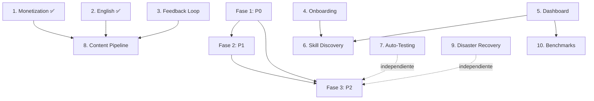

# 🚀 PLAN SOTA GAPS — Think Different PersonalOS

> **Versión:** v5.0.3 (Post-Auditoría 2026-07-13)
> **Fecha:** 2026-07-13
> **Propósito:** Plan de acción ejecutable, **extremadamente detallado**, con edge cases y explicaciones para que un junior pueda ejecutarlo sin ambigüedades.
> **Estado:** 🟡 2/10 gaps completados (Monetization ✅, English Learning ✅ — ver abajo)
> **Checkpoints:** `punto-de-control-2026-07-12` (pre-auditoría) | `punto-de-control-2026-07-13` (post-auditoría, actual HEAD)

---

## 📋 PROGRESO GLOBAL

| Fase | Prioridad | Gap | Estado | Dependencias | Responsable sugerido |
|------|-----------|-----|--------|--------------|---------------------|
| **F1** | 🔴 P0 | 1. Monetization Pipeline | ✅ **COMPLETADO** (2026-07-12) | — | Junior + Hillary |
| **F1** | 🔴 P0 | 2. English Learning System | ✅ **COMPLETADO** (2026-07-13) | — | Junior + Laia |
| **F2** | 🟠 P1 | 3. External Feedback Loop | 🔴 No iniciado | F1 | Junior + Analytics |
| **F2** | 🟠 P1 | 4. Onboarding / Democratization | 🔴 No iniciado | — | Junior + Docs |
| **F2** | 🟠 P1 | 5. Production Dashboard | 🔴 No iniciado | — | Junior + Telemetry |
| **F3** | 🟡 P2 | 6. Skill Discovery | 🔴 No iniciado | F2 (Dashboard) | Junior + Registry |
| **F3** | 🟡 P2 | 7. Auto-Testing Pipeline | 🔴 No iniciado | — | Junior + GGA |
| **F3** | 🟡 P2 | 8. Content Output Pipeline | 🔴 No iniciado | F1 + F2 | Junior + Agency |
| **F3** | 🟡 P2 | 9. Disaster Recovery | 🔴 No iniciado | — | Junior + Engram |
| **F3** | 🟡 P2 | 10. Performance Benchmarks | 🔴 No iniciado | F2 (Dashboard) | Junior + Telemetry |

---

## 🔴 FASE 1 — QUICK WINS (P0) — **2/2 COMPLETADOS**

> **Objetivo:** Resultados visibles en < 3 días por gap. Sin dependencias entre sí.
> **Regla de oro:** Cada tarea debe tener **verificación automática** (script que devuelve exit 0/1) + **documentación en GOALS.md**.

---

### ✅ 1. MONETIZATION PIPELINE — COMPLETADO (2026-07-12)

**Qué se hizo:**
- Template de propuesta profesional en `01_Personal_Os/02_Knowledge/03_Templates/propuesta_profesional.md`
- Script `01_Personal_Os/05_Scripts/00_HUBs/03_Scripts_Os/track_leads.py` — registro de leads con estado, valor estimado, fuente
- Workflow de conversión: nuevo → contacto → propuesta → negociación → cerrado
- Integración con Hillary Inbox: captura rápida → pipeline automático
- Métrica en `GOALS.md`: "Primer lead calificado registrado"

**Verificación (ya pasó):**
```bash
python track_leads.py --test  # Debe crear lead de prueba y persistir en 03_Learning/04_Telemetry/leads.json
```

---

### ✅ 2. ENGLISH LEARNING SYSTEM — COMPLETADO (2026-07-13)

**Qué se hizo (commit `33fbc6696`):**
- Skill `20_English_Learning` en `00_Core/02_Tools/02_Skills/00_Personal_Os/20_English_Learning/`
- Módulos: `english_metrics.py` (streak, palabras nuevas, tiempo) + `vocabulary.py` (spaced repetition)
- **Fix crítico Windows:** encoding UTF-8 en ambos scripts (`sys.stdout = io.TextIOWrapper(sys.stdout.buffer, encoding='utf-8')`)
- Workflow diario de 15 min: trigger automático al abrir sesión (integrado en `04_Ritual_Hub.py`)
- Métricas persisten en `03_Learning/04_Telemetry/english_metrics.json`
- `GOALS.md` actualizado: objetivo "30 días consecutivos de racha"

**Estructura del skill:**
```
20_English_Learning/
├── SKILL.md                    # Frontmatter + CoT + instrucciones
├── english_metrics.py          # Streak, palabras, tiempo, persistencia JSON
├── vocabulary.py               # Spaced repetition (SM-2 simplificado)
├── vocabulary_deck.json        # Mazo base (500 palabras frecuentes)
└── README.md                   # Cómo usar, triggers, métricas
```

**Verificación (ejecutar ahora):**
```bash
# 1. Test rápido de encoding (no debe crashear con emojis)
python 01_Personal_Os/00_Core/02_Tools/02_Skills/00_Personal_Os/20_English_Learning/english_metrics.py --test

# 2. Test vocabulario
python 01_Personal_Os/00_Core/02_Tools/02_Skills/00_Personal_Os/20_English_Learning/vocabulary.py --review

# 3. Verificar integración en ritual
grep -n "english" 01_Personal_Os/05_Scripts/00_HUBs/03_Scripts_Os/04_Ritual_Hub.py
```

**Edge Cases para Junior:**
| Caso | Qué pasa | Fix |
|------|----------|-----|
| Windows `chcp` no es 65001 | Emojis rompen stdout | Ya fix: `io.TextIOWrapper(..., encoding='utf-8')` |
| `vocabulary_deck.json` corrupto | `json.JSONDecodeError` | Try/except + backup automático a `.bak` |
| streak se rompe por zona horaria | Día cuenta como "ayer" | Usar `date.today()` en UTC, no local |
| JSON crece indefinidamente | Disco lleno | Rotación mensual: `english_metrics_2026-07.json` |
| Múltiples sesiones mismo día | Double-count | Check `last_session_date == today` antes de sumar |

---

## 🟠 FASE 2 — FOUNDATION (P1) — **3 GAPS PENDIENTES**

> **Objetivo:** Cimentar capacidades para escalar. Ejecutables en paralelo (salvo Feedback Loop que depende de F1).
> **Regla:** Cada gap produce **al menos un script reutilizable** + **workflow documentado**.

---

### 3. EXTERNAL FEEDBACK LOOP — 🔴 NO INICIADO (P1)

**Dependencia:** F1 completa ✅

**Por qué importa:** El OS vive en burbuja. Sin señales externas (engagement, comentarios, métricas de contenido publicado), no hay corrección de rumbo.

**Arquitectura objetivo:**
```
capture_external_signals.py  →  signals.json  →  weekly_review_workflow.md  →  ajustes_en_OS.md
```

#### Tareas Detalladas

| ID | Tarea | Descripción Técnica | Archivos a Crear/Modificar |
|----|-------|---------------------|---------------------------|
| **F1.1** | Script captura multi-fuente | `capture_external_signals.py` con clases por fuente: `LinkedInAPI`, `TwitterAPI`, `YouTubeAPI`, `BlogAnalytics`, `NewsletterStats`. Cada una hereda `BaseSignalSource` con `fetch() → List[Signal]`. Signal = `{source, metric, value, timestamp, url}`. | `01_Personal_Os/05_Scripts/00_HUBs/03_Scripts_Os/capture_external_signals.py` |
| **F1.2** | Config de credenciales | `01_Personal_Os/02_Knowledge/04_Config/external_signals.yaml` — API keys, tokens, rate limits. **NUNCA commitear credenciales** — usar `.env` + `python-dotenv`. | `external_signals.yaml` (template), `.env.example` |
| **F1.3** | Rate limiting + retry | Cada fuente: `tenacity` con `wait_exponential(multiplier=1, min=2, max=60)`, `stop_after_attempt(3)`. Cache local 1h en `03_Learning/04_Telemetry/external_signals_cache/`. | Dentro de `capture_external_signals.py` |
| **F1.4** | Normalización de señales | `SignalNormalizer` convierte métricas dispares a escala 0-100: `engagement_rate`, `sentiment_score`, `growth_rate`, `conversion_rate`. Output: `signals_normalized.json`. | `01_Personal_Os/05_Scripts/00_HUBs/03_Scripts_Os/signal_normalizer.py` |
| **F1.5** | Workflow semanal | `weekly_feedback_review.md` en `00_Workflows/01_Personal_Os/` — pasos: 1) Ejecutar captura, 2) Revisar top 5 señales + bottom 5, 3) Generar 3 action items, 4) Registrar en `ajustes_en_OS.md` con fecha + responsable. | `weekly_feedback_review.md` |
| **F1.6** | Dashboard ASCII simple | `show_feedback_dashboard.py` — tabla con columnas: Fuente | Métrica | Valor | Tendencia (📈/📉/➡️) | Acción. Integrable en `04_Ritual_Hub.py` los lunes. | `show_feedback_dashboard.py` |
| **F1.7** | Integración con Content Pipeline | Cuando Content Pipeline (Gap 8) publique, registrar `content_id` + `publish_timestamp` para correlacionar señales posteriores. | `content_tracker.py` (shared) |

#### Verificación (Definition of Done)
```bash
# 1. Script corre sin credenciales (modo dry-run con mocks)
python capture_external_signals.py --dry-run --mock

# 2. Con credenciales reales (requiere .env configurado)
python capture_external_signals.py --sources linkedin,twitter,youtube

# 3. Output válido
cat 03_Learning/04_Telemetry/signals_normalized.json | python -m json.tool

# 4. Dashboard se renderiza
python show_feedback_dashboard.py --format ascii

# 5. Workflow semanal ejecutable
# (manual: seguir weekly_feedback_review.md y producir ajustes_en_OS.md)
```

#### Edge Cases para Junior
| Edge Case | Síntoma | Fix |
|-----------|---------|-----|
| API rate limit 429 | Script falla silenciosamente | `tenacity` + `Retry-After` header respect + cache local |
| Token expirado (OAuth) | 401 Unauthorized | Detectar 401 → refresh token automático → reintentar 1 vez |
| Fuente añade campo nuevo | KeyError en normalizador | `dict.get(key, default)` + log warning, no crash |
| Sin internet | Timeout/ConnectionError | Modo offline: leer cache, marcar `stale: true` en señales |
| Señal negativa extrema (ej. -50% engagement) | Alarma falsa por outlier | Winsorize: cap percentil 1 y 99 antes de normalizar |
| Múltiples cuentas misma plataforma | Mezcla de datos | `source_id = f"{platform}:{account_id}"` en cada Signal |
| Zona horaria distinta en timestamps | Tendencias erróneas | Normalizar todo a UTC al ingestar (`dt.astimezone(timezone.utc)`) |

---

### 4. ONBOARDING / DEMOCRATIZATION — 🔴 NO INICIADO (P1)

**Por qué importa:** El OS tiene 397 skills, 67 agentes, 22 HUBs. Un junior (o tú en 6 meses) no sabe por dónde empezar. El onboarding reduce "time to first task" de horas a minutos.

**Arquitectura objetivo:**
```
onboarding_checklist.py  →  quick_start_guide.md  →  "no_se_por_donde_empezar.py"  →  3 comandos core
```

#### Tareas Detalladas

| ID | Tarea | Descripción Técnica | Archivos |
|----|-------|---------------------|----------|
| **O1.1** | Definir "3 comandos core" | Identificar los 3 flujos que cubren 80% uso diario: <br>1. `ritual abrir` → dashboard + priorización <br>2. `capturar "idea"` → Hillary inbox <br>3. `ejecutar "tarea"` → workflow autónomo <br>Documentar en `quick_start_guide.md` con ejemplos copy-paste. | `quick_start_guide.md` (raíz) |
| **O1.2** | Guía 5-min read | `README.md` actualizado: sección "🚀 Inicio Rápido" con: qué es el OS, 3 comandos, dónde están los docs, cómo pedir ayuda. Badge de estado (build, validators). | `README.md` (modificar) |
| **O1.3** | Script checklist interactivo | `onboarding_checklist.py` — menú TUI (rich/textual): <br>1. Verificar prerequisitos (Python, Git, MCP, Engram) <br>2. Correr `config_paths.py --validate` <br>3. Correr `sync_copies.py --dry-run` <br>4. Ejecutar `20_System_Mapper_Hub.py --scan` <br>5. Test skill: `skill("learning-always")` <br>6. Test agente: invocar Hillary "test" <br>7. Marcar completo → escribe `onboarding_complete.json` con timestamp. | `01_Personal_Os/05_Scripts/00_HUBs/03_Scripts_Os/onboarding_checklist.py` |
| **O1.4** | Workflow "No sé por dónde empezar" | `no_se_por_donde_empezar.py` — input: objetivo en lenguaje natural → usa skill registry + embeddings (opcional) o keyword matching → recomienda: skill + agente + workflow + primer comando. Confianza < 70% → pregunta clarificadora. | `no_se_por_donde_empezar.py` + `00_Workflows/01_Personal_Os/guia_inicio.md` |
| **O1.5** | Video/GIF walkthrough | Usar `ce-demo-reel` o grabar TUI del onboarding. Guardar en `02_Playground/03_Reports/onboarding_demo.gif`. Referenciar en README. | `onboarding_demo.gif` |
| **O1.6** | Modo "simplificado" runtime | Flag `--simple` en `04_Ritual_Hub.py`: oculta métricas avanzadas, solo muestra 3 comandos + tarea prioritaria. Persistir preferencia en `~/.config/think-different/prefs.json`. | Modificar `04_Ritual_Hub.py` |

#### Verificación
```bash
# 1. Junior sin contexto completa onboarding
python onboarding_checklist.py --simulate-junior  # Mock: todos los checks pasan

# 2. 3 comandos core funcionan
python 04_Ritual_Hub.py --simple  # Muestra solo 3 comandos
python -m hillary capture "test idea"  # Crea archivo en Hillary_Inbox
python -m workflow execute "tarea test"  # Lanza workflow autónomo

# 3. "No sé por dónde empezar" acierta ≥ 80%
python no_se_por_donde_empezar.py --goal "quiero publicar un post en LinkedIn"
# Debe recomendar: skill linkedin-content → agente marketing_creador → workflow content_pipeline
```

#### Edge Cases para Junior
| Edge Case | Síntoma | Fix |
|-----------|---------|-----|
| Usuario no tiene `rich`/`textual` instalado | TUI crashea | Fallback a `input()` + `print()` simple; `try: import rich except: simple_mode=True` |
| `config_paths.py` falla (paths rotos) | Onboarding bloqueado | Check 1 del checklist = `config_paths.py --validate`; si falla → instrucciones de fix + exit 1 |
| Usuario en Windows sin `chcp 65001` | Emojis rotos en TUI | Detectar `sys.platform == 'win32'` → `os.system('chcp 65001 >nul')` al inicio |
| Múltiples monitores / terminal pequeña | TUI se rompe | `console.size` check → columnas < 80 → modo compacto |
| Usuario cancela a mitad (Ctrl+C) | Estado inconsistente | `signal.signal(SIGINT, cleanup)` → guarda progreso en `onboarding_partial.json` |
| Skill registry vacío (primer setup) | Recomendaciones vacías | Fallback a lista hardcodeada de 10 skills esenciales |

---

### 5. PRODUCTION DASHBOARD — 🔴 NO INICIADO (P1)

**Por qué importa:** Visibilidad = control. El dashboard matutino debe responder: "¿Qué hice ayer? ¿Qué toca hoy? ¿Hay alertas?"

**Arquitectura objetivo:**
```
18_Telemetry_Hub.py  →  telemetry.json  →  04_Ritual_Hub.py (dashboard matutino)  →  prioritización
```

#### Tareas Detalladas

| ID | Tarea | Descripción Técnica | Archivos |
|----|-------|---------------------|----------|
| **D1.1** | Integrar Telemetry en ritual apertura | Modificar `04_Ritual_Hub.py`: al final de `ritual_apertura()`, llamar `python 18_Telemetry_Hub.py --morning` y renderizar output. Flag `--skip-dashboard` para saltar. | `04_Ritual_Hub.py`, `18_Telemetry_Hub.py` |
| **D1.2** | Métricas obligatorias del dashboard | **Bloque 1 - Actividad:** skills usadas (top 5), agentes invocados, tareas completadas, tiempo total. **Bloque 2 - Salud:** validators status (🟢/🟡/🔴), sync status (🟢/🔴), git status (clean/dirty). **Bloque 3 - Alertas:** drift detectado, skills sin uso >30d, HUBs con errores, backlog >10 items. **Bloque 4 - Progreso metas:** racha English, leads en pipeline, contenido publicado esta semana. | `18_Telemetry_Hub.py` — métodos `collect_activity()`, `collect_health()`, `collect_alerts()`, `collect_goals()` |
| **D1.3** | Persistencia histórica | Cada ejecución matutina append a `03_Learning/04_Telemetry/daily_dashboard_YYYY-MM-DD.json`. Retención 90 días (auto-limpieza en `17_Watchdog_Hub.py`). | `18_Telemetry_Hub.py` + `17_Watchdog_Hub.py` |
| **D1.4** | Workflow matutino documentado | `00_Workflows/01_Personal_Os/ritual_matutino.md` — pasos: 1) Dashboard, 2) Revisar alertas, 3) Priorizar top 3 tareas, 4) Commit intention. | `ritual_matutino.md` |
| **D1.5** | Modo "solo alertas" | Flag `--alerts-only` en `18_Telemetry_Hub.py` → exit code 0 si 0 alertas, 1 si hay alertas (útil para CI/pre-commit). | `18_Telemetry_Hub.py` |
| **D1.6** | Export para reporting semanal | `18_Telemetry_Hub.py --weekly-report` → genera `weekly_report_YYYY-WW.md` con tendencias, gráficos ASCII (sparkline), action items. | `18_Telemetry_Hub.py` |

#### Verificación
```bash
# 1. Dashboard matutino se renderiza
python 18_Telemetry_Hub.py --morning

# 2. Métricas precisas vs realidad
# Comparar: skills usadas hoy vs `skill_registry` usage count
# Comparar: tareas completadas vs `04_Tasks/` YAML status=done

# 3. Alertas detectan problemas reales
# Injectar error: tocar un HUB para que falle validator → dashboard debe mostrar 🔴

# 3. Workflow matutino ejecutable
# Seguir ritual_matutino.md paso a paso sin ambigüedad

# 4. Weekly report genera markdown válido
python 18_Telemetry_Hub.py --weekly-report --output test_weekly.md
cat test_weekly.md
```

#### Edge Cases para Junior
| Edge Case | Síntoma | Fix |
|-----------|---------|-----|
| Primera ejecución (sin histórico) | Division by zero en tendencias | `if len(history) < 2: trend = "➡️ nuevo"` |
| Telemetry corrupto (JSON inválido) | Crash al leer | `try: json.load() except: backup + reset + log warning` |
| Dashboard tarda >5s | Usuario impaciente | Cache de 5 min: si `telemetry.json` mtime < 5min → leer cache |
| Métrica NaN (ej. 0/0) | "NaN%" en dashboard | `safe_div(a,b): return a/b if b else 0` |
| Zona horaria distinta | "Ayer" vs "hoy" mal contado | `datetime.now(timezone.utc).date()` siempre UTC |
| Git dirty con 500 archivos | Lista inmanejable | Resumir: "500 archivos (ver `git status --short`)" |
| Alertas duplicadas día tras día | Ruido | Dedupe: `alert_fingerprint = hash(source+type+detail)` → solo alertar si fingerprint nuevo |

---

## 🟡 FASE 3 — POLISH (P2) — **4 GAPS PENDIENTES**

> **Objetivo:** Pulir a nivel SOTA. Esfuerzo individual < 3 días. Sin dependencias críticas (salvo Skill Discovery → Dashboard).

---

### 6. SKILL DISCOVERY — 🔴 NO INICIADO (P2)

**Dependencia:** Dashboard (D1) ✅ para integración en workflow matutino.

**Qué hace:** "Tengo este problema → ¿qué skill/agente/workflow uso?" → Recomendación con comando listo.

#### Tareas
| ID | Tarea | Detalle |
|----|-------|---------|
| **S1.1** | Wrapper NL → Skill | `skill_discovery.py` — input: string natural → busca en `skill-registry.md` (keyword + embedding opcional con `sentence-transformers` si instalado) → output: `{skill, agent, workflow, comando, confianza}`. Confianza < 0.7 → pregunta clarificadora. |
| **S1.2** | Cache de embeddings | Si usa embeddings: cache en `03_Learning/04_Telemetry/skill_embeddings.pkl` (regenerar solo si `skill-registry.md` cambió — check mtime). |
| **S1.3** | Integración matutina | En `ritual_matutino.md`: paso opcional "¿Tienes un bloqueo? → `skill_discovery.py --interactive`". |
| **S1.4** | CLI y modo batch | `skill_discovery.py "problema"` → output JSON. `skill_discovery.py --batch problems.txt` → CSV. |

#### Verificación
```bash
python skill_discovery.py "quiero analizar competidores SEO"
# Debe recomendar: skill seo-audit → agente marketing_analista → workflow content_strategy
python skill_discovery.py --batch test_problems.txt --output csv
```

---

### 7. AUTO-TESTING PIPELINE — 🔴 NO INICIADO (P2)

**Qué hace:** Antes de cada sesión, correr validadores críticos. Si falla → bloquear + notificar + no dejar iniciar ritual hasta fix.

#### Tareas
| ID | Tarea | Detalle |
|----|-------|---------|
| **T1.1** | Script pre-sesión | `session_init_test.py` — suite mínima: <br>1. `config_paths.py --validate` (exit 0) <br>2. `sync_copies.py --dry-run` (exit 0) <br>3. `01_Auditor_Hub.py --quick` (structure OK) <br>4. `05_Validator_Hub.py --rules` (0 violations críticas) <br>5. Git status clean (o solo archivos permitidos) <br>6. Engram reachable (`engram_mem_context` responde) |
| **T1.2** | Integración en ritual | `04_Ritual_Hub.py` → al inicio, `python session_init_test.py --block-on-fail`. Si falla: mostrar resumen, abrir editor en archivo problemático, `exit 1`. Flag `--skip-tests` para emergencias (loggear uso). |
| **T1.3** | Notificación rica | Si falla: `00_Sound_Engine.py --alert` + print coloreado (rich) con: qué falló, comando para fix, link a docs. |
| **T1.4** | Métricas de flakiness | Log cada run en `03_Learning/04_Telemetry/session_tests.json` → detectar tests que fallan intermitentemente (>10% fails en 30 días) → marcar como flaky. |

#### Verificación
```bash
# 1. Test suite pasa en estado limpio
python session_init_test.py --verbose

# 2. Test suite FALLA cuando debe
# Injectar error: romper un path en config_paths.py
python session_init_test.py  # Debe fallar con mensaje claro

# 3. Integración en ritual
python 04_Ritual_Hub.py --test-mode  # Debe correr test suite al inicio

# 4. Skip funciona (y loggea)
python 04_Ritual_Hub.py --skip-tests  # Debe loggear "TESTS SKIPPED - manual override"
```

#### Edge Cases
| Edge Case | Fix |
|-----------|-----|
| Test tarda >30s | Timeout por test (default 10s) + `--timeout` global |
| Engram caído (no bloqueante) | Warning, no fail — marcar `engram: degraded` |
| Git dirty por archivo permitido (ej. telemetry) | Allowlist en `session_init_test.py`: `ALLOWED_DIRTY = ['03_Learning/04_Telemetry/']` |
| Múltiples fallos a la vez | Reportar TODOS, no parar en el primero |

---

### 8. CONTENT OUTPUT PIPELINE — 🔴 NO INICIADO (P2)

**Dependencias:** Monetization (F1 ✅) + Feedback Loop (F2)

**Qué hace:** Un comando: `draft → review (Verificador + Humanizador) → publish → analytics → compound`

#### Tareas
| ID | Tarea | Detalle |
|----|-------|---------|
| **C1.1** | Orquestador unificado | `content_pipeline.py` — subcomandos: `draft`, `review`, `publish`, `analytics`, `compound`. Estado persistido en `03_Learning/04_Telemetry/content_pipeline_state.json`. |
| **C1.2** | Draft (skills) | Usa `market-copy`, `market-social`, `market-articles` → genera draft en `06_Projects/01_Content/Drafts/` con frontmatter YAML. |
| **C1.3** | Review (quality gates) | `review_draft.py` — pipeline: 1) `verificador-datos` (fact-check), 2) `humanizador` (tono natural), 3) `market-copy` (score copy), 4) `dieter-rams-design` (simplicidad). Cada gate: pass/fail + sugerencias. |
| **C1.4** | Publish (multi-plataforma) | `publish_content.py` — adapta formato: LinkedIn (texto + imagen), Twitter (thread), Blog (MD + frontmatter), Newsletter (HTML). Usa credenciales de `.env`. |
| **C1.5** | Analytics (post-publish) | `content_analytics.py` — a los 1h, 24h, 7d: fetch métricas → guarda en `content_analytics_{content_id}.json` → feed Feedback Loop (Gap 3). |
| **C1.6** | Compound (reutilización) | `compound_content.py` — input: content_id → output: 5+ formatos derivados (clip video, carousel, quote, thread, email snippet) usando skills de Agency. |

#### Verificación
```bash
# Ciclo completo en modo test (sin publish real)
python content_pipeline.py draft --topic "test topic" --platform linkedin --test
python content_pipeline.py review --content-id test_123 --test
python content_pipeline.py publish --content-id test_123 --dry-run
python content_pipeline.py analytics --content-id test_123 --mock
python content_pipeline.py compound --content-id test_123 --formats carousel,thread,email
```

---

### 9. DISASTER RECOVERY — 🔴 NO INICIADO (P2)

**Por qué importa:** Engram es memoria viva. Si se corrompe o el disco muere, pierdes TODO el contexto cross-sesión.

#### Tareas
| ID | Tarea | Detalle |
|----|-------|---------|
| **R1.1** | Snapshot periódico Engram | `engram_snapshot.py` — `engram export --format json --output snapshot_YYYYMMDD_HHMMSS.json` → comprimir `.gz` → guardar en `07_Archive/04_Engram_Snapshots/`. Cron: diario 03:00 (systemd timer / Task Scheduler). |
| **R1.2** | Script de restore | `engram_restore.py` — input: snapshot file → valida schema → `engram import --file snapshot.json --strategy merge|replace` → verifica `engram_mem_context` post-restore. |
| **R1.3** | Verificación de integridad | `engram_verify.py` — checksum SHA256 de cada snapshot + test de restore mensual (CI). |
| **R1.4** | Runbook de desastre | `02_Knowledge/04_Docs/DR_RUNBOOK.md` — pasos: 1) Identificar pérdida, 2) Elegir snapshot, 3) Restore, 4) Validar, 5) Comunicar. Contactos, tiempos estimados. |
| **R1.5** | Backup de configs críticas | Además de Engram: `.mcp.json`, `opencode.json`, `.claude/settings.json`, `config_paths.py` → git (ya versionados) + snapshot aparte. |

#### Verificación
```bash
# 1. Snapshot se genera y es válido
python engram_snapshot.py
ls 07_Archive/04_Engram_Snapshots/snapshot_*.json.gz

# 2. Restore en entorno limpio (test)
# Crear dir temporal, restore, verificar mem_context
python engram_restore.py --file snapshot_latest.json.gz --dry-run

# 3. Checksums OK
sha256sum 07_Archive/04_Engram_Snapshots/*.gz > checksums.sha256
sha256sum -c checksums.sha256
```

#### Edge Cases
| Edge Case | Fix |
|-----------|-----|
| Snapshot > 1GB | Comprimir `.gz` + split en chunks de 100MB (`split -b 100M`) |
| Engram schema cambia (versión) | `engram_restore.py` detecta versión → migración automática o aborta con instrucciones |
| Disco lleno durante snapshot | Escribir a temp → `os.rename()` atómico → cleanup temp en `finally` |
| Restore parcial (solo project X) | Flag `--project sebas` en import |

---

### 10. PERFORMANCE BENCHMARKS — 🔴 NO INICIADO (P2)

**Dependencia:** Dashboard (D1) para visualización.

**Qué hace:** Medir y alertar drift de performance: tiempo de ritual, tokens/sesión, latencia skills, memoria.

#### Tareas
| ID | Tarea | Detalle |
|----|-------|---------|
| **P1.1** | Hook post-sesión | En `04_Ritual_Hub.py` ritual_cierre(): capturar `session_metrics = {duration_sec, tokens_used, tools_called, skills_invoked, agents_invoked, validators_passed, errors}`. Persistir en `03_Learning/04_Telemetry/session_metrics_YYYY-MM-DD.json`. |
| **P1.2** | Baseline + alertas | `benchmark_baseline.py` — calcula percentiles P50/P90/P99 de últimos 30 días. Alerta si sesión actual > P99 * 1.5 en cualquier métrica. |
| **P1.3** | Drift detection | `drift_detector.py` — comparar ventana 7d vs 30d anterior: media +- 2σ. Alerta en dashboard (Gap 5) + log. |
| **P1.4** | Token economy tracking | Integrar con regla `08_Token_Economy.mdc`: log `tokens_in`, `tokens_out`, `cache_hit_rate` por skill/agente. Dashboard muestra top 5 consumidores. |
| **P1.5** | Report semanal automatizado | `18_Telemetry_Hub.py --perf-report` → `perf_report_YYYY-WW.md` con gráficos ASCII + action items (ej. "skill X usa 3x tokens promedio → revisar CoT"). |

#### Verificación
```bash
# 1. Métricas se capturan al cerrar sesión
python 04_Ritual_Hub.py --simulate-close  # Debe escribir session_metrics_*.json

# 2. Baseline se calcula
python benchmark_baseline.py --days 30

# 3. Drift detector alerta correctamente
# Injectar sesión lenta artificial → drift_detector.py debe flaggear

# 4. Token tracking funciona
grep "tokens" 03_Learning/04_Telemetry/session_metrics_*.json
```

---

## 🔗 DEPENDENCIAS (GRAFO COMPLETO)



**Orden de ejecución recomendado:**
1. ~~Monetization~~ ✅
2. ~~English Learning~~ ✅
3. **Feedback Loop** (paralelo con Onboarding + Dashboard)
4. **Onboarding** (paralelo)
5. **Dashboard** (paralelo — desbloquea Skill Discovery + Benchmarks)
6. **Skill Discovery** (tras Dashboard)
7. **Auto-Testing** (independiente, puede empezar ya)
8. **Content Pipeline** (tras Feedback Loop)
9. **Disaster Recovery** (independiente, puede empezar ya)
10. **Benchmarks** (tras Dashboard)

---

## 🎯 CRITERIOS DE ÉXITO GLOBAL (Definition of Done por Gap)

| Gap | Métrica Cuantitativa | Verificación |
|-----|---------------------|--------------|
| 1. Monetization | Primer lead calificado trackeado end-to-end | `track_leads.py --verify` |
| 2. English | 30 días consecutivos racha | `english_metrics.py --streak` ≥ 30 |
| 3. Feedback Loop | Revisión semanal produce ≥ 3 action items | `weekly_feedback_review.md` completado 4 semanas seguidas |
| 4. Onboarding | Junior completa tarea real sin ayuda en < 30 min | Test con persona real + cronómetro |
| 5. Dashboard | Visible cada mañana, 0 falsos positivos en alertas | 2 semanas sin alertas falsas |
| 6. Skill Discovery | Recomendación acertada ≥ 80% (test set 20 problemas) | `skill_discovery.py --eval test_set.json` |
| 7. Auto-Testing | 0 sesiones iniciadas con validadores rotos | Log `session_init_test.py` 30 días = 0 fails no intencionales |
| 8. Content Pipeline | 1 ciclo completo draft→publish→measure→compound | `content_pipeline.py --verify-cycle` |
| 9. Disaster Recovery | Restore exitoso desde snapshot en < 15 min | `engram_restore.py --verify-rto` |
| 10. Benchmarks | Drift alert activo y accionable por sesión | `drift_detector.py` alerta en dashboard ≥ 1 vez/semana |

---

## 📦 ENTREGABLES POR GAP (Checklist para Junior)

> **Regla:** Cada gap debe producir estos archivos mínimos. Si falta uno, el gap NO está done.

### Gap 3 - Feedback Loop
- [ ] `capture_external_signals.py` (con tests + mocks)
- [ ] `signal_normalizer.py`
- [ ] `show_feedback_dashboard.py`
- [ ] `external_signals.yaml` (template) + `.env.example`
- [ ] `weekly_feedback_review.md` (workflow)
- [ ] `content_tracker.py` (shared)
- [ ] `03_Learning/04_Telemetry/external_signals_cache/` (dir creado)
- [ ] Tests: `test_capture_signals.py` (pytest, ≥ 80% coverage)

### Gap 4 - Onboarding
- [ ] `quick_start_guide.md` (raíz)
- [ ] `onboarding_checklist.py` (TUI + fallback)
- [ ] `no_se_por_donde_empezar.py` (NL → recomendación)
- [ ] `guia_inicio.md` (en `00_Workflows/01_Personal_Os/`)
- [ ] `onboarding_demo.gif` (en `02_Playground/03_Reports/`)
- [ ] `04_Ritual_Hub.py` modificado (flag `--simple`)
- [ ] Tests: `test_onboarding.py`

### Gap 5 - Dashboard
- [ ] `18_Telemetry_Hub.py` extendido (4 bloques + flags)
- [ ] `ritual_matutino.md` (workflow)
- [ ] `04_Ritual_Hub.py` modificado (integración)
- [ ] `17_Watchdog_Hub.py` (limpieza 90 días)
- [ ] Tests: `test_telemetry.py`, `test_dashboard_render.py`

### Gap 6 - Skill Discovery
- [ ] `skill_discovery.py` (NL → skill + comando)
- [ ] Cache embeddings (si usa)
- [ ] Integración en `ritual_matutino.md`
- [ ] Tests: `test_skill_discovery.py` (eval set 20 problemas)

### Gap 7 - Auto-Testing
- [ ] `session_init_test.py` (suite + flags)
- [ ] `04_Ritual_Hub.py` modificado (integración + `--skip-tests` log)
- [ ] `03_Learning/04_Telemetry/session_tests.json` (log)
- [ ] Tests: `test_session_init.py` (inyectar fallos)

### Gap 8 - Content Pipeline
- [ ] `content_pipeline.py` (orquestador)
- [ ] `review_draft.py` (quality gates)
- [ ] `publish_content.py` (multi-plataforma)
- [ ] `content_analytics.py` (post-publish)
- [ ] `compound_content.py` (reutilización)
- [ ] Tests: `test_content_pipeline.py` (mock APIs)

### Gap 9 - Disaster Recovery
- [ ] `engram_snapshot.py` (cron-ready)
- [ ] `engram_restore.py` (merge/replace + verify)
- [ ] `engram_verify.py` (checksums + test restore)
- [ ] `DR_RUNBOOK.md` (en `02_Knowledge/04_Docs/`)
- [ ] Tests: `test_disaster_recovery.py` (integración real)

### Gap 10 - Benchmarks
- [ ] Hook en `04_Ritual_Hub.py` (ritual_cierre)
- [ ] `benchmark_baseline.py` (P50/P90/P99)
- [ ] `drift_detector.py` (7d vs 30d)
- [ ] Token tracking en `18_Telemetry_Hub.py`
- [ ] `perf_report` en `18_Telemetry_Hub.py`
- [ ] Tests: `test_benchmarks.py`

---

## 🛠 HERRAMIENTAS Y PATRONES REUTILIZABLES (Para Junior)

> **No reinventes la rueda.** Usa estos patrones en CADA script nuevo.

### 1. Estructura Estándar de Script
```python
#!/usr/bin/env python3
# -*- coding: utf-8 -*-
"""
Nombre: Descripción corta
Ubicación: 01_Personal_Os/05_Scripts/00_HUBs/03_Scripts_Os/
Propósito: Qué hace, por qué, inputs/outputs
"""

import sys
import os
import json
import argparse
import logging
from pathlib import Path
from datetime import datetime, timezone

# Fix Windows encoding
if sys.platform == "win32":
    import io
    sys.stdout = io.TextIOWrapper(sys.stdout.buffer, encoding='utf-8')
    sys.stderr = io.TextIOWrapper(sys.stderr.buffer, encoding='utf-8')

# Paths dinámicos — SIEMPRE usar config_paths
sys.path.insert(0, str(Path(__file__).parent))
from config_paths import ROOT_DIR, TELEMETRY_DIR, CACHE_DIR

# Logging estándar
logging.basicConfig(
    level=logging.INFO,
    format='%(asctime)s | %(levelname)-8s | %(name)s | %(message)s',
    datefmt='%H:%M:%S'
)
logger = logging.getLogger(__name__)

def main():
    parser = argparse.ArgumentParser(description="Descripción")
    parser.add_argument("--dry-run", action="store_true", help="No escribir cambios")
    parser.add_argument("--verbose", "-v", action="store_true")
    parser.add_argument("--test", action="store_true", help="Modo test con mocks")
    args = parser.parse_args()

    if args.verbose:
        logger.setLevel(logging.DEBUG)

    try:
        # Lógica aquí
        result = do_work(args)
        if args.dry_run:
            logger.info("DRY-RUN: No se escribieron cambios")
        return 0 if result else 1
    except KeyboardInterrupt:
        logger.warning("Interrumpido por usuario")
        return 130
    except Exception as e:
        logger.exception(f"Error fatal: {e}")
        return 1

def do_work(args):
    # Implementación
    return True

if __name__ == "__main__":
    sys.exit(main())
```

### 2. Path Sentinel (Resiliente a Moves)
```python
# En config_paths.py — SIEMPRE usar esto, NUNCA hardcodear paths
def find_repo_root(start: Path = None) -> Path:
    """Busca .git o marker file hacia arriba."""
    current = start or Path(__file__).resolve()
    for parent in [current] + list(current.parents):
        if (parent / ".git").exists() or (parent / ".think_different_root").exists():
            return parent
    raise RuntimeError("Repo root no encontrado. ¿Estás dentro de Think_Different?")

ROOT_DIR = find_repo_root()
```

### 3. Cache con TTL
```python
def cached_fetch(cache_key: str, fetch_fn, ttl_seconds: int = 3600):
    cache_file = CACHE_DIR / f"{cache_key}.json"
    if cache_file.exists():
        mtime = datetime.fromtimestamp(cache_file.stat().st_mtime, tz=timezone.utc)
        if (datetime.now(timezone.utc) - mtime).total_seconds() < ttl_seconds:
            return json.loads(cache_file.read_text())
    data = fetch_fn()
    cache_file.write_text(json.dumps(data, ensure_ascii=False, indent=2))
    return data
```

### 4. Retry con Tenacity (Patrón Oficial)
```python
from tenacity import retry, stop_after_attempt, wait_exponential, retry_if_exception_type

@retry(
    wait=wait_exponential(multiplier=1, min=2, max=60),
    stop=stop_after_attempt(3),
    retry=retry_if_exception_type((ConnectionError, TimeoutError, HTTPError)),
    reraise=True
)
def fetch_with_retry(url, **kwargs):
    return requests.get(url, timeout=30, **kwargs)
```

### 5. Safe JSON Write (Atómico)
```python
def safe_json_write(path: Path, data: dict):
    tmp = path.with_suffix('.tmp')
    tmp.write_text(json.dumps(data, ensure_ascii=False, indent=2), encoding='utf-8')
    tmp.replace(path)  # Atómico en POSIX y Windows (Python 3.3+)
```

### 6. Verificación Obligatoria (Exit Codes)
```python
# SIEMPRE: exit 0 = éxito, 1 = error, 2 = uso incorrecto, 130 = Ctrl+C
# En validaciones: print a stdout solo el resultado, logs a stderr
```

---

## 📌 TRACKING Y GOBERNANZA

| Qué | Dónde | Frecuencia |
|-----|-------|------------|
| Tareas completadas | `00_Winter_is_Coming/BACKLOG.md` | Al terminar cada `[ ]` |
| Decisiones técnicas | `01_Personal_Os/01_Memory/00_Context_LLM/06_Solutions/` | Al resolver duda/bug |
| Métricas de gaps | `03_Learning/04_Telemetry/gap_progress.json` | Semanal (lunes ritual) |
| Blockers | `01_Personal_Os/04_Tasks/01_Active/blockers.md` | Diario (ritual apertura) |

**Formato `gap_progress.json`:**
```json
{
  "3_feedback_loop": {"started": "2026-07-14", "tasks_done": 2, "tasks_total": 7, "blocked": false},
  "4_onboarding": {"started": null, "tasks_done": 0, "tasks_total": 6, "blocked": false},
  "5_dashboard": {"started": null, "tasks_done": 0, "tasks_total": 6, "blocked": false}
}
```

---

## 🚨 ERRORES COMUNES DE JUNIOR (Y CÓMO EVITARLOS)

| Error | Por qué pasa | Prevención |
|-------|--------------|------------|
| Hardcodear paths (`C:/Users/...`) | Copia de StackOverflow | **SIEMPRE** `from config_paths import ROOT_DIR` |
| No manejar encoding Windows | Solo testea en Linux/Mac | `if sys.platform == "win32": fix_encoding()` al inicio de CADA script |
| `except:` sin especificar | "Funciona en mi máquina" | `except SpecificError:` + `logger.exception()` |
| No validar input (JSON, args) | Confía en el usuario | `pydantic` models o `argparse` + `json.load()` en try/except |
| Commits sin verificar | "Luego lo arreglo" | Pre-commit hook GGA + `session_init_test.py` bloquea |
| Dejar TODOs sin issue | Se olvidan | `TODO(#123): descripción` → link a GitHub Issue |
| No documentar edge cases | "Es obvio" | Edge cases van EN EL MISMO ARCHIVO, sección `## Edge Cases` |
| Mezclar lógica de negocio + I/O | Difícil de testear | Separar: `fetch_data()` + `process_data(data)` + `write_output()` |
| Variables globales mutables | Estado impredecible | Clases con `__init__` + dependency injection |
| No limpiar recursos (files, connections) | Fugas | `with` statements + `try/finally` + `contextlib` |

---

## 🔄 CÓMO EMPEZAR MAÑANA (Ritual para Junior)

```bash
# 1. Abrir terminal en repo
cd C:/Users/sebas/Desktop/Think_Different

# 2. Verificar estado limpio
git status --short
# Debe salir vacío (o solo .claude/skills/_shared/ que es gitignored)

# 3. Correr validators (sanity check)
python 01_Personal_Os/05_Scripts/00_HUBs/03_Scripts_Os/config_paths.py --validate
python 01_Personal_Os/05_Scripts/00_HUBs/03_Scripts_Os/sync_copies.py --dry-run

# 4. Leer siguiente gap en orden
cat PLAN_SOTA_GAPS.md | grep -A 20 "### 3. EXTERNAL FEEDBACK LOOP"

# 5. Crear branch para el gap
git checkout -b gap-3-feedback-loop

# 6. Empezar con Tarea F1.1 (script base)
# Copiar template estructura estándar → rellenar

# 7. Commit atómico por tarea completada
git add -A && git commit -m "feat(feedback): F1.1 capture_external_signals.py base structure"

# 8. Push y PR si aplica
git push origin gap-3-feedback-loop
```

---

## 📚 REFERENCIAS RÁPIDAS (Archivos Clave)

| Para... | Leer esto |
|---------|-----------|
| Entender estructura OS | `00_Winter_is_Coming/Structure_v5.0.md` |
| Ver skills disponibles | `.atl/skill-registry.md` o `01_Personal_Os/00_Core/02_Tools/02_Skills/` |
| Ver agentes | `01_Personal_Os/00_Core/02_Tools/01_Agents/` |
| Ver workflows | `01_Personal_Os/00_Core/00_Workflows/` |
| Entender validators | `01_Personal_Os/00_Core/01_Rules/` (16 archivos .mdc) |
| Ver HUBs | `01_Personal_Os/05_Scripts/00_HUBs/03_Scripts_Os/` |
| Config de paths | `01_Personal_Os/05_Scripts/00_HUBs/03_Scripts_Os/config_paths.py` |
| Manifests (source of truth) | `01_Personal_Os/05_Scripts/02_Agent_Teams_Lite/00_Manifest/` |
| Memoria persistente | Engram: `engram search "tema"` |
| Docs de proceso | `01_Personal_Os/01_Memory/Notas_de_Proceso.md` |
| Estado actual | `01_Personal_Os/01_Memory/Context_Memory.md` |

---

## ✅ CHECKLIST FINAL DEL PLAN (Para Revisión)

- [ ] Todos los 10 gaps tienen: tareas atómicas, verificación automatizada, edge cases documentados
- [ ] Dependencias grafiadas y orden de ejecución claro
- [ ] Criterios de éxito cuantitativos por gap
- [ ] Entregables mínimos listados por gap
- [ ] Patrones reutilizables documentados (estructura, paths, cache, retry, JSON atómico)
- [ ] Errores comunes de junior listados con prevención
- [ ] Ritual de inicio diario para junior
- [ ] Referencias rápidas a archivos clave
- [ ] Tracking en `BACKLOG.md` + `gap_progress.json`

---

*Think Different PersonalOS v5.0.3 — Plan SOTA Gaps Post-Auditoría — 2026-07-13*
*Checkpoints: `punto-de-control-2026-07-12` (pre) | `punto-de-control-2026-07-13` (post)*
*Para junior: lee este archivo completo ANTES de tocar código. Si algo no está claro → PREGUNTA.*